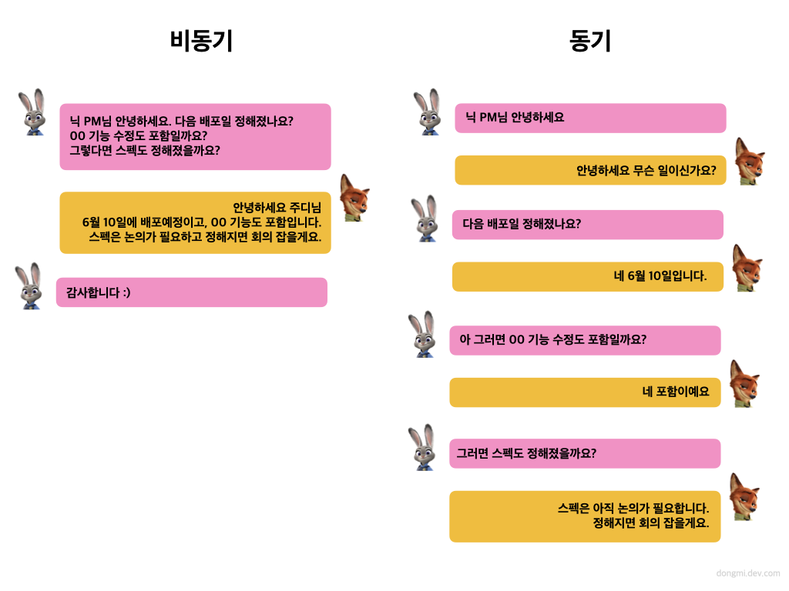

대부분의 프로그램은 비동기적으로 실행된다. 함수가 완료되지 않아도 다른 함수를 실행할 수 있다.  
자기 할 일을 끝내지 않아도 말이다.  
왜 대부분 비동기적으로 실행될까? 유저와 인터랙션이 중요하기 때문이다.

> 자바스크립트는 그 탄생 목적 자체가 사용자와의 상호작용이다.
>
> -더글러스 크락포드

## 비동기와 동기 방식의 차이

비동기와 동기 방식에 따라서 사용자가 겪는 경험이다.

**비동기 방식**

- 함수가 호출되고 실행되는 동안 사용자는 UI 렌더링을 **관찰**할 수 있다.
- 호출이 완료될 동안 응답이 오지 않아도 **다른 작업을 수행할 수 있다.**

**동기 방식**

- 함수가 호출되고 실행이 완료될 때까지 UI 렌더링이 **차단**된다.
- 함수 실행이 완료된 후에 사용자는 업데이트 된 UI를 볼 수 있다.
- 동기 코드 실행 시간이 길어지면 페이지가 멈춘 것처럼 보인다.
  사용자는 답답해서 새로고침을 할 수 있다. 그러면 다시 동기 방식의 호출이 이루어지고 고장난 웹 어플리케이션처럼 보일 수 있다.



현실에서도 동기와 비동기식 커뮤니케이션 방식이 있다.

이 대화에서 주디의 질문은 요청이 되고, 닉의 답변은 응답이 된다.  
대화 사이에 닉이나 주디가 회의에 들어가서 응답 시간이 길어질 수 있다.

응답시간이 달라지는 점까지 고려한다면 비동기가 더 효율적임을 알 수 있다.

> 실제 세계는 비동기적(asynchronus)이다. 동기적(synchronus)인 것은 하나도 없다.  
> 많은 일이 항상 일어나고 있다. 자연은 비동기식으로 작동한다.  
> 컴퓨터 시스템도 비동기식으로 만들어지는 게 자연스럽다.
>
> -아마존 CTO

**동기와 비동기 장단점**

동기는 사용자 경험에 좋지 않은 한계가 있었다.  
응답 대기 시간이 길고, 동시에 여러 작업을 할 수 없기 때문이다.

비동기 방식을 적용하면 이런 불편함들을 해결할 수 있다.

예를 들어 이미지가 렌더링되는 동안 사용자는 또 다른 작업을 할 수도 있다.

## 논블로킹(Non-Blocking)

`비동기로 처리했다`, `비동기 로직을 적용했다`  
이러 말들은 논블로킹을 내포하고 있다와 동일하다.

우리가 아는 방식은 동기+블로킹이고, 비동기+논블로킹이다.

블로킹과 논블로킹은 막을 수 있는 권한을 가진 개념이다.  
이 둘의 관심사는 **제어권**이 어느 쪽에 있는지다.

> 블로킹, blocking
>
> 1. 농구에서, 상대 선수의 진행을 신체적 접촉에 의해 방해하는 일. 반칙임.
> 2. 권투에서, 상대의 펀치를 팔이나 팔꿈치, 어깨 등으로 막아 공격을 저지하는 일.

블로킹은 호출된 함수가 완료될 때까지 제어권을 갖고 있다.  
첫번째로 호출된 함수가 종료되지 않는다면 다른 함수들은 실행될 수 없다.

논블로킹은 종료 여부를 신경쓰지 않는다. **호출된 함수에게 바로 제어권을 넘긴다.**

## 싱글 스레드(Single Thread)

자바스크립트는 싱글 스레드 기반 언어이다.  
브라우저에서 실행되는 자바스크립트 코드는 싱글 스레드 환경에서 동작한다.  
자바스크립트 엔진은 한 번에 하나의 작업만 할 수 있다.

> 스레드(Thread)  
> : 하나의 프로세스 안에서 작업을 담당하는 최소 실행 단위  
> ex) 크롬 브라우저(=프로세스)에서 유투브 음악듣기(스레드1), 블로그 글쓰기(스레드2)

이 말은 자바스크립트로 비동기 작업을 할 수 없다는 말이다.

자바스크립트가 처음 등장했을 때는 비동기 통신에 대한 설계를 고려하지 않았기 때문이다.

## 자바스크립트의 비동기 처리

싱글 스레드 언어인데 비동기 처리를 어떻게 하는걸까? 🤔

### 1. 이벤트 루프

비밀은 자바스크립트 실행 환경(런타임)인 브라우저 내부에 있다.  
특히 **이벤트 루프**가 핵심 역할을 한다.

싱글 스레드에서는 함수 호출 스택(Call Stack)이 하나만 존재하기 때문에 **한 번에 하나의 작업만** 처리할 수 있다.  
그래서 **동시성**을 지원하기 위해 이벤트 루프 모델을 고안했다.

동시성에 관해서는 뒤에서 얘기하겠다.


브라우저 엔진은 `Web APIs`, `Call Stack`, `Task Queue`, `Event Loop` 등으로 구성되어 있다.  
자바스크립트 코드가 실행될 때 브라우저와의 동작은 아래 그림으로 표현할 수 있다.

- Call Stack: 실행된 코드의 환경을 저장하는 자료구조, 함수 호출 시 Call Stack에 push 된다.
- Web APIs: DOM, setTimeout, setInterval 등 브라우저가 제공하는 API
- Task Queue
  - 이벤트 발생 시 실행해야 할 콜백 함수가 추가된다. (이벤트는 click, mouserMove 같은)
  - Task Queue와 Callback Queue는 같은 말이다.
  - Task Queue는 Micro, Macro로 나뉜다.
- Event Loop:
  - Call Stack과 Task Queue를 감시한다.
  - 감시하다가 **Call Stack이 비어있으면, Queue에서 함수를 꺼내 Call Stack에 넣는다.**

#### 엔진의 동작 순서

```js
console.log('첫번째 로그')

setTimeout(() => {
  console.log('콜백함수 로그')
}, 0)

console.log('세번째 로그')
```

콘솔 로그 사이에 `setTimeout` 타이머 함수가 있다.  
setTimeout은 0초 뒤에 `() => {console.log('콜백함수 로그')}` 콜백 함수를 호출한다.

순차적인 흐름으로 보면 `console.log('세번째 로그')`가 무조건 마지막에 출력될 것 같다.

하지만 실제 실행 결과는 그렇지 않다.  
`console.log('콜백함수 로그')`가 마지막에 찍힌다.

```
첫번째 로그
세번째 로그
콜백함수 로그
```

타이머 함수가 0초 뒤에 실행되는 점을 생각하면 의아하다.

브라우저 엔진의 동작 순서를 살펴 보겠다.

1. `console.log('첫번째 로그')`가 Call Stack에 추가(Push)된다.
2. `console.log('첫번째 로그')`가 실행되어 출력되고, Call Stack에서 제거(Pop)된다.
3. `setTimeout(() => {console.log('콜백함수 로그')}, 0)`이 Call Stack에 추가된다.
4. setTimeout 함수가 실행되고 WebAPIs를 호출한다. 그리고 Call Stack에서 제거된다.  
   (실행은 되었지만 출력되지는 않았다.)
5. `console.log('세번째 로그')` Call Stack에 추가된다.
6. `console.log('세번째 로그')`가 실행되어 출력되고, Call Stack에서 제거된다.

여기서부터 주목해야 한다.

7. WebAPIs에 있던 타이머 함수가 Task Queue에 추가된다.
8. 감시자인 Event Loop는 비어있는 Call Stack을 확인했다.  
   그리고 이벤트 루프는 Task Queue에 있는 타이머 함수를 Call Stack에 추가한다.
9. 타이머 함수가 0초 뒤에 실행되고 `console.log('콜백함수 로그')`가 Call Stack에 추가된다.
10. `console.log('콜백함수 로그')`가 출력되고 Call Stack에서 제거된다.

#### 비동기 콜백을 통한 블로킹 완화

Call Stack에서 작업이 실행되고 있을 때 UI는 블로킹된다.

`setTimeout`은 비동기 콜백 함수다.  
이렇게 비동기 콜백으로 작업을 실행하게 되면 Call Stack이 비는 시점이 존재한다.  
그 시점에 렌더링이 될 수 있는 틈이 생긴다.

이게 바로 비동기 콜백을 사용하는 이유이며, 이벤트 루프의 중요한 역할이다.

### 2. 비동기 처리를 위한 지원

자바스크립트 코어에는 비동기적인 부분이 전혀 없다고 했다.  
그렇지만 비동기 처리를 위해 강력한 기능들을 제공한다.

1. 콜백
2. 프로미스
3. async/await

이 글에서는 간단한 소개만 한다.

#### 콜백

가장 기본적인 비동기 프로그래밍 방식이다.

콜백은 다른 함수에 전달하는 함수다. 인자를 함수를 전달한다는 말이다.  
어떤 이벤트가 일어나거나 조건이 만족되면 콜백 함수를 호출한다.

만약 콜백 함수에 또 함수 인자가 담겨 있다면 위이 과정이 반복된다.  
그러면 많이 들은 콜백 지옥이 완성될 수 있다.

```
setTimeout(() => {
  console.log('첫 번째 작업 완료');
  setTimeout(() => {
    console.log('두 번째 작업 완료');
    setTimeout(() => {
      console.log('세 번째 작업 완료');
      // 추가 작업 수행 가능
    }, 2000);
  }, 2000);
}, 2000);
```

`setTimeout` 함수는 비동기적으로 작동하며, 0.2초 이후마다 콜백 함수를 실행한다.  
이 방법은 콜백이 콜백 안에서 **끝없이 중첩**되게 한다. **코드 가독성이 엉망이 된다**.  
또한 **에러 핸들링이 어렵다**. 에러가 발생하면 에러를 전달할 방법이 없기 때문이다.

#### 프로미스

프로미스는 콜백을 더 단순하게 사용하는 새로운 방법이다.  
중첩된 콜백들을 우리가 보기 쉽도록 **프로미스 체인**으로 바꿔 준다.

프로미스는 비동기 처리의 방법이면서 비동기 작업의 **결과**를 나타내는 객체다.

```js
// 프로미스로 데이터 가져오기
function fetchDataWithPromise() {
  return fetch('https://api.dummy.com/data').then(response => response.json())
}

// 프로미스 사용
fetchDataWithPromise()
  .then(data => {
    console.log('데이터:', data)
  })
  .catch(error => {
    console.log('에러:', error)
  })
```

- 자바스크립트의 내장 함수인 `fetch`는 프로미스 객체를 반환한다.
- 프로미스 객체는 `then()` 인스턴스 메서드가 있다.
- 가상의 API를 호출하고 응답받은 데이터를 json 데이터로 변환한다.
- `fetchDataWithPromise()` 함수를 호출하고 `then`과 `catch` 메서드를 통해 성공과 에러 로직을 작성한다.

`then` 메서드에 두번째 함수를 전달해 에러를 처리할 수도 있다.  
그렇지만 프러미스 체인에 `catch()`를 메서드를 추가하는 방식이 일반적이다.

#### async/await

앞에서 프로미스가 콜백을 단순화한 방법이라고 했다.  
async와 await은 프로미스 사용을 더 단순화했다.

우리 눈은 위에서 아래 순서로 향한다.  
이런 흐름처럼 읽기 쉽도록 프로미스 기반의 비동기 코드를 동기적으로 작성할 수 있게 한다.  
프로미스랑 별개는 아니다. 프로미스를 숨겼을 뿐이다.

## 동시성(Concurrency)과 병렬성(Parallelism)

비동기 작업은 완료 여부를 따지지 않으므로 **동시에 여러 개의** 작업을 할 수 있다.

그러면 비동기 처리의 특징은 동시성과 병렬성이 되는 걸까?  
처음에 이해하기 어려웠다. 별개는 아니지만 같은 개념도 아니기 때문이다.

동시성은 싱글 코어에서 멀티 스레드를 동작시키기 위한 방식이고,  
병렬성은 멀티 코어에서 멀티 스레드를 동작시키는 방식이다.

동시성은 동시에 실행되는 **것처럼** 보이는 것이고,  
병렬성은 **실제로** 동시에 여러 작업이 처리되는 것이다.

> `Promise.all()`을 통해 비동기 작업들을 병렬적으로 실행할 수 있다.

**비동기 로직은 동시성을 다루는 방식** 중 하나다.  
여러 작업들이 동시에 실행되는 것처럼 보이지만,  
실제로는 하나의 프로세서에서 번갈아가며 실행된다.

따라서 비동기는 동시성의 하위 집합이라고 볼 수 있다.

## 비동기는 async가 아니다!?

자바스크립트 구루인 더글라스 크락포드는 말한다. `async`는 잘못된 키워드라고.  
Asynchronous 대신에 Eventual Programming이라고 비동기를 표현한다.

자바에는 동기화(Synchronized)라는 게 있다. 설계자들이 시간과 관련된 단어에서 따왔다고 한다.
`async`는 자바의 동기화에서 왔다. 동기화에서 반대의 뜻인 `a` prefix만 붙인 것이다.

이런 관점으로 보면 동시성이랑 비동기를 헷갈릴 수도 있겠다 싶다.

> **자바의 Synchronized**  
> 스레드 동기화는 멀티스레드 환경에서 여러 스레드가 하나의 공유자원에 동시에 접근하지 못하도록 막는 것이다.  
> 공유데이터가 사용되어 동기화가 필요한 부분을 임계영역(critical section)이라고 부른다.  
> 자바에서는 이 임계영역에 synchronized 키워드를 사용하여 여러 스레드가 동시에 접근하는 것을 금지함으로써 동기화를 할 수 있다.

## 요약

- 비동기는 호출하면 즉각 반환한다.
- 자바스크립트 코어에는 비동기에 대한 설계가 없다.
- 그렇지만 브라우저 엔진의 이벤트 루프와 비동기 처리 기능이 지원된다.
- 콜백 함수는 무한 중첩과 에러 핸들링이 어려운 한계가 있다.
- 프로미스는 `then()` 메소드의 선형 체인으로 중첩을 막는다.
  `catch()` 메소드로 에러 핸들링이 가능하다.
- `async`와 `await` 키워드는 비동기 코드를 동기적 코드처럼 작성할 수 있게 한다.
- 비동기 처리는 동시성, 병렬성과는 엮여 있지만 다른 개념이다.

## 참고 아티클

- [JavaScript 비동기 핵심 Event Loop 정리](https://medium.com/sjk5766/javascript-%EB%B9%84%EB%8F%99%EA%B8%B0-%ED%95%B5%EC%8B%AC-event-loop-%EC%A0%95%EB%A6%AC-422eb29231a8)
- [동기 vs 비동기, 블로킹 vs 논블로킹 쉽게 이해하기](https://siyoon210.tistory.com/147)
