크로미움의 아키텍처를 살펴 보려면 내용이 방대합니다.    
프론트엔드 업무에 도움이 되는 부분은 렌더링 파이프라인이며, 이를 먼저 알아야 전체 구조를 이해하기 쉬웠습니다.  
그래서 렌더링 아키텍처에 대한 소개를 간략하게 하고, 렌더링 작동 순서와 방법에 대해 자세히 알아 보겠습니다.

크로미움의 렌더링 과정을 알게 되면 성능 최적화 방법들에 대한 이해도가 높아질 수 있습니다.

## 브라우저의 구성
브라우저 엔진은 웹을 렌더링하기 위한 역할을 하며, 대표적으로 Chromium, Webkit, Gecko 엔진이 있습니다.
- Chromium: Chrome, Edge, Naver Whale, Arc, Opera
- Webkit: Safari
- Gecko: FireFox

크로스 브라우징을 적용하기 위해 벤더 프리픽스로 많이 보는 친구들입니다.

Chromium은 오픈소스 브라우저 프로젝트이며, Chrome, Edge 등은 Chromium 기반으로 커스텀된 브라우저입니다.
Chromium은 브라우저는 물론 일렉트론을 포함한 여러 프레임워크에서도 많이 쓰이고 있습니다.

### Chromium의 RenderingNG 아키텍처
압도적인 점유율인 Chromium 엔진은 주요 특징은 RenderingNG 아키텍처입니다.
2021년에 업데이트 되었고, [현재도 계속 개선중](https://www.chromium.org/teams/rendering/)입니다.

RenderingNG 아키텍처는 렌더링 엔진인 Blink를 개선하기 위해 업데이트되었습니다.
Blink에 대해서는 아래 내용에서 다루니까 넘어 가겠습니다.

>Let's call it RenderingNG, since it is truly a next-generation rendering architecture that greatly outperforms what came before. RenderingNG has been in progress for at least eight years, and represents the collective work of many dedicated Chromium developers. It unlocks a huge amount of potential for the next generation of fast, fluid, reliable, responsive and interactive web content. It's also a baseline that I believe defines a new minimum standard for all web rendering engines that developers can rely on.  
> 이전보다 훨씬 뛰어난 성능을 자랑하는 진정한 차세대 렌더링 아키텍처이므로 RenderingNG라고 부르겠습니다. RenderingNG는 최소 8년 이상 개발이 진행되어 왔으며, 수많은 헌신적인 Chromium 개발자들의 공동 작업의 결과물입니다. 이 기술은 빠르고 유동적이며 안정적이고 반응성이 뛰어난 차세대 인터랙티브 웹 콘텐츠에 대한 엄청난 잠재력을 열어줍니다. 또한 개발자가 신뢰할 수 있는 모든 웹 렌더링 엔진의 새로운 최소 표준을 정의하는 기준이기도 합니다.  
> [RenderingNG](https://developer.chrome.com/articles/renderingng/)

#### 프로세스 종류
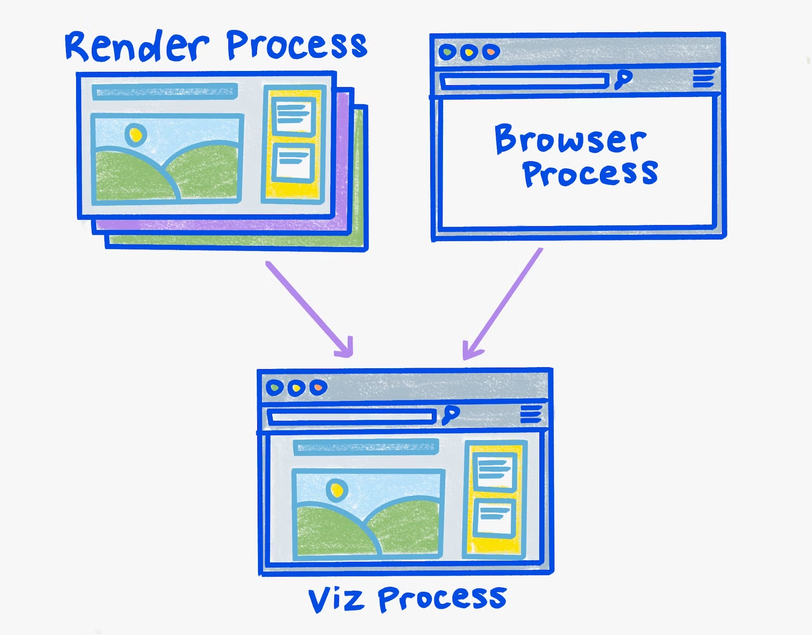

Chromium의 RenderingNG 아키텍처는 **멀티 프로세스 아키텍처**로 되어 있습니다. 

- Renderer Process: 웹 페이지를 어떻게 그리고 칠할 것인지에 대한 명령어 구성
- Browser Process: 브라우저의 주요 기능들을 관리 (탭, 윈도우, 주소 표시줄, 북마크, 뒤로 가기 버튼 등의 UI 등)
- GPU Process: Renderer Process로부터 전달받은 렌더링 결과를 실제로 처리

세 프로세스 중에서 Renderer Process에 대해 다루겠습니다.

크롬을 하나 실행시켜 네이버에 접속하여 작업 관리자를 보겠습니다.
작업 관리자 도구를 보면 브라우저, GPU, 렌더러, 유틸리티 프로세스가 보입니다.

| 탭 1개(Naver) | 탭 2개(Naver, Github) |
|-|-|
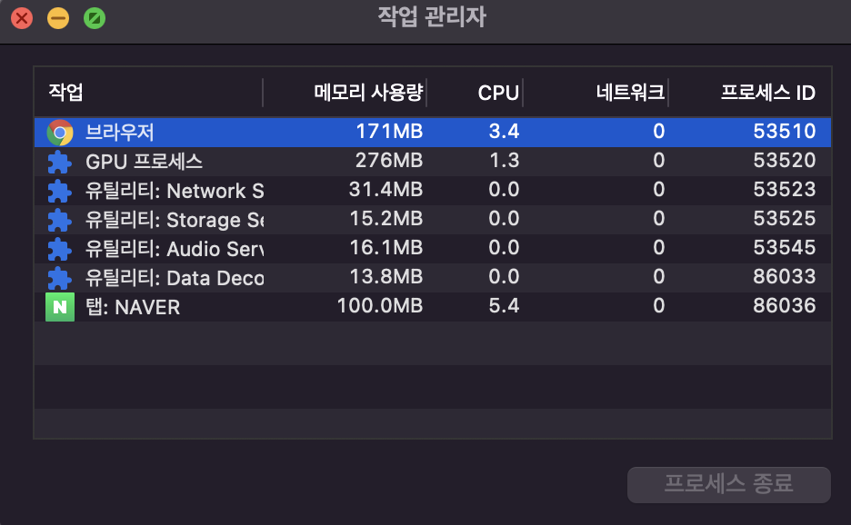 | 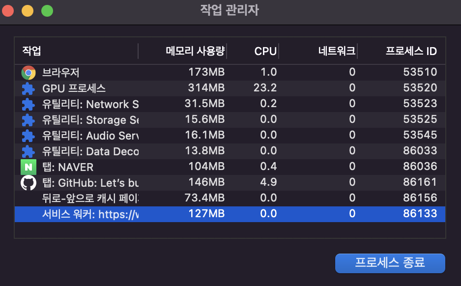 |

왼쪽 크롬의 작업 관리자를 보면 Naver 탭이 **탭 프로세스**입니다. 

> 작업관리자 확인: 우측 상단 크롬 환경설정 -> 도구 더보기 -> 작업 관리자

각 탭은 별도의 Renderer 프로세스를 가집니다. 
이를 통해 탭마다 Renderer 프로세스가 할당되고 있음을 알 수 있습니다. 

그럼 이제 오른쪽의 Github도 추가된 작업 관리자를 보면 Github 탭 프로세스가 추가되었습니다.

탭 프로세스는 추가되었지만, 그외 브라우저와 GPU 프로세스는 그대로 하나입니다.
이제 탭 프로세스는 렌더러 프로세스로 말하겠습니다.

#### 보안과 병렬성 
왜 렌더러 프로세스는 여러 개이고 GPU 프로세스는 하나로 구성할까요?

각자가 하는 작업이 달라 보안읖 높이고 병렬 작업을 가능하게 해 성능을 개선하기 위해서 입니다.
렌더러는 렌더링을 하기 위한 준비 작업이고, GPU는 렌더러가 준비한 결과물로 화면을 그립니다.

케이크 집으로 비유하면 렌더러 프로세스는 케이크를 위한 밑작업이고, GPU는 준비된 반죽, 토핑들을 합쳐서 실제 우리가 보게 될 케이크를 만드는 작업이겠습니다.
(더 자세한 내용은 뒤에서 설명하므로 여기서는 간단하게 이해하고 가겠습니다.)

**이렇게 역할이 다르기 때문에 작업 별로 프로세스를 분리하여 보안을 높이고 병렬 작업이 가능해 집니다.**    
딸기 케이크 밑작업을 하면서, 망고 케이크 토핑을 합칠 수 있겠지요.

그리고 각 탭마다 별도의 렌더러 프로세스를 가지게 된다고 했었습니다.  
이렇게 하면 **각 탭이 독립적으로 작동할 수 있어, 한 탭에서 문제가 발생하더라도 다른 탭에는 영향을 주지 않습니다.**
장애의 전파를 방지할 수 있습니다.

또한 GPU 프로세스는 Skia, OpenGL, Vulkan의 그래픽 라이브러리를 이용해 화면에 픽셀을 그립니다.   
외부 파일이기 때문에 이 그래픽 라이브러리에 대한 오류는 Chromium이 제어할 수 없습니다. 그래서 이런 그래픽 라이브러리가 실행되는 작업을 GPU 프로세스로 한정지어 렌더러 프로세스를 보호할 수 있습니다. 

## 브라우저와 렌더링 파이프라인의 관계
렌더링 파이프라인은 텍스트 기반 리소스를 전달받은 브라우저가 이 파일들을 이용해 화면에 보여주기 까지의 과정입니다.  
텍스트 기반 리소스는 HTML, CSS, JavaScript가 있습니다.

> 구글의 어떤 아티클에서는 픽셀 파이프라인으로 언급되는데, 렌더링 파이프라인과 같은 의미입니다.

이제 렌더러와 GPU 프로세스가 어떻게 렌더링에 관여하고 있는 지 알아 보겠습니다.

브라우저의 렌더링 과정에 대해 공부해 보셨다면 익숙한 이미지입니다.
이 이미지는 Chrome, Safari, FireFox 등 여러 브라우저의 렌더링 파이프라인을 단순화시킨 과정입니다.

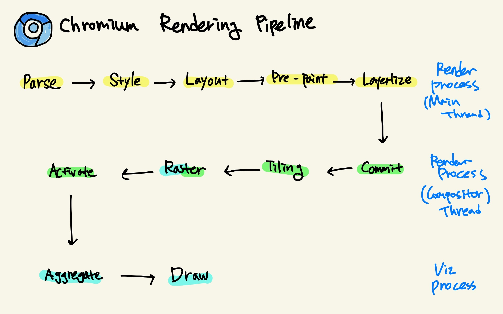

위의 이미지는 더 세분화시킨 크로미움의 렌더링 파이프라인입니다.

## 렌더링 파이프라인

위에서 말했던 케이크 이야기가 생각나시나요?

우리가 보기위한 브라우저를 굽기 위해 렌더링 파이프라인은 크게는 Renderer 프로세스와 Viz 프로세스로 나뉩니다.

이전에는 Viz가 아니라 GPU 프로세스로 분리했습니다. 최근은 Viz로 표시하고 있으며, Visualization(시각화)를 의미합니다.
내용을 살펴보면 Viz 프로세스는 더 개선된 GPU 프로세스의 확장이라고 볼 수 있습니다.

> Alternatively, we could think of Viz as an augmentation of the GPU process.
>...
>You'll recall that Viz is the GPU process augmented with more stuff -- like the DisplayCompositor.  
>[Viz: Chrome Graphics Futures](https://github.com/chromium/mus-preso/blob/master/blinkon8/speakernotes.md)

### Renderer Process - Main Thread
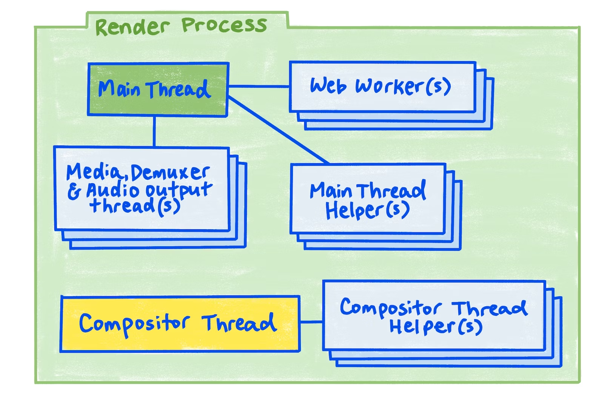

렌더러 프로세스는 메인 스레드(Main Thread)와 합성 스레드(Compositor Thread)로 구성되어 있습니다.
메인 스레드는 **Blink 엔진**이 실행하며, Blink는 화면을 그리기 위한 명령어들을 생성합니다.
합성 스레드는 GPU 프로세스에게 명령어를 전달하기 위한 작업을 하고, 명령어들을 받아서 GPU가 화면을 그리는 것입니다.

렌더러 프로세스도 단일 스레드가 아닙니다. 메인 스레드가 명령어도 생성하고, 전달하기 위한 작업까지 하자니 너무 무거워 집니다.
그래서 작업 부하를 줄이고, 여러 작업을 동시에 처리하기 위한 병렬성을 위해 메인 스레드랑 합성 스레드로 나누는 것입니다

- 렌더러 프로세스
  - 메인 스레드(Main Thead, Blink): 화면을 그리기 위한 명령어 생성
     - Web Worker 
     - Main Thread Helper
     - Media 
  - 합성 스레드(Compositor Thread): 명령어들을 GPU에 전달하는 상호작용을 위한 작업

#### Parse
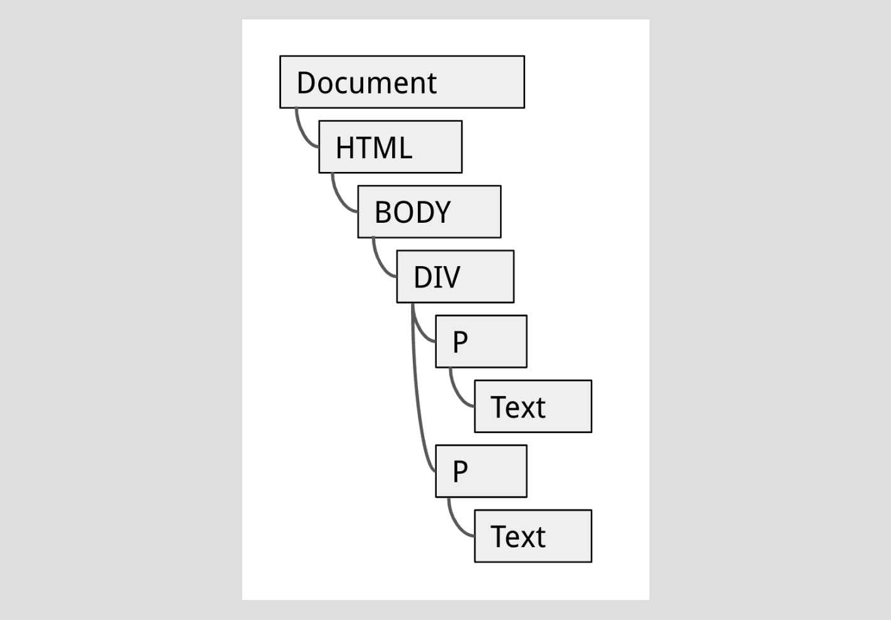

Blink 엔진은 C++로 작성되었습니다.
그래서 Blink가 전달받은 HTML을 C++ 객체로 바꿔서 트리화 하는 과정이 Parse입니다.
이 트리를 DOM 트리라고 하고, C++ 객체를 노드라고 말하기도 합니다.

파싱을 하다가 중간에 멈추게 되는 때가 있습니다.
- `async`, `defer` 같은 블로킹 리소스를 만나 지연되는 경우
- 중간에 `<script>` 태그를 만나는 경우로 스크립트에 있는 코드를 실행하고, 다시 파싱합니다.

#### Style
DOM 트리 파싱 이후에 브라우저는 CSS 규칙을 파싱하여 CSSOM(CSS Object Modal)을 만듭니다.

다음 세 번의 과정이 필요합니다.

1. CSS 규칙 파싱 및 인덱싱
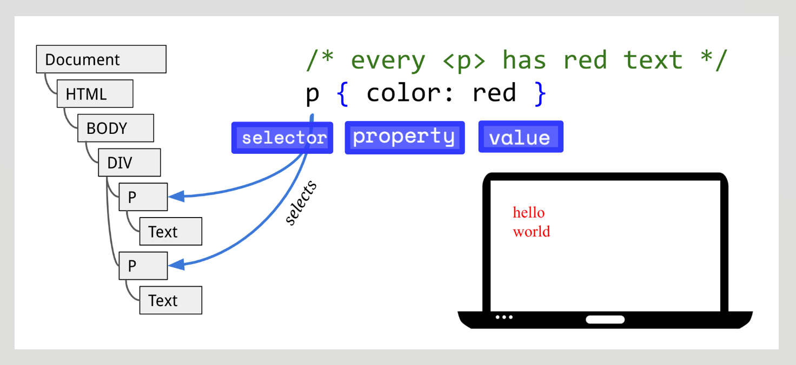

첫 번째 단계는 웹 페이지에 포함된 모든 스타일 시트의 CSS 규칙을 파싱하고 인덱싱하는 과정입니다. 각 CSS 규칙은 선택자(selector), 속성(property), 값(value)을 포함하며, Blink 엔진의 CSSParser를 통해 이들 규칙이 파싱됩니다.

각 규칙은 `StyleSheetContents`라는 저장 공간에 CSSRules의 형태로 저장됩니다.

2. ComputedStyles 생성

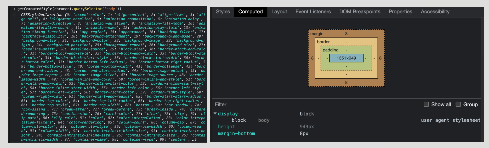
스타일 시트를 기반으로 최종적으로 결정된 ComputedStyles을 생성합니다.

이전에는 스타일 재계산이 일어날 때, ComputedStyles가 항상 최종 값을 가져오지 않는 버그가 있었습니다.  
이는 ComputedStyles가 불변이 아니며 이후 파이프라인의 과정에서 계속 수정될 수 있었음을 말합니다.

최신 LayoutNG 아키텍처에서는 가변성을 개선하여 스타일 단계 이후에는 ComputedStyles가 불변값을 유지할 수 있도록 했습니다.

3. DOM 요소에 ComputedStyle 객체를 붙여 CSSOM 생성

마지막 단계는 앞서 찾아낸 CSS 규칙을 기반으로 최종 스타일을 계산하고, 이 정보를 ComputedStyle 객체에 저장하여 CSSOM을 생성하는 과정입니다. 이 생성된 CSSOM은 DOM에 연결됩니다.

#### Layout
레이아웃 과정에서는 스타일 시트를 기반으로 요소를 어떤 크기로 어디에 위치해야 할 지 결정하며,  
레이아웃의 결과는 Fragment tree라는 변하지 않는 트리(immutable tree)입니다. 

예전에는 DOM 트리와 CSSOM을 합친 Layout Object를 만들고, 이 객체로 Layout tree를 생성했습니다.
각 객체는 width, height, x와 y값 같은 정보를 가지고 있습니다.

**Layout Tree와 Fragment Tree**
Layout Tree와 Fragment Tree의 차이는 mutable인지, immutable인지 입니다.
다시 말해 변하냐, 안 번하냐의 **불변성**의 차이입니다.

Layout tree에서 Fragment tree로 개선된 이유를 알기 위해서는 크로미움의 성능 개선을 위한 **Dirty bit**라는 시스템 이해가 필요합니다.

영상처럼 레이아웃 계산 비용(Layout cost)은 비싼 편입니다.   
폰트 크기, 줄바꿈에 따라서도 크기가 다시 계산되어야 하기 때문입니다.

**Dirty Bit**
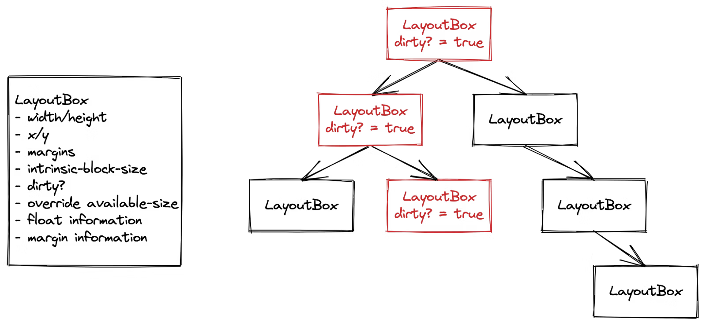

그래서 크로미움은 Dirty bit라는 디자인으로 레이아웃을 덜 게산하도록 했습니다.
Dirty bit는 특정 요소가 변화했음을 표시하는 플래그입니다. 요소의 위치나 크기에 변경이 필요한 해당 요소를 dirty라고 표시합니다.
그러면 레이아웃이 재귀적으로 실행될 때, 더티 요소와 그 하위 요소만 다시 계산하므로 리소스 낭비가 줄어듭니다.

하지만 레이아웃 트리는 뒤에 파이프라인 과정이 진행되면서 계속 변경될 수 있었습니다.
똑같은 Layout 과정 내에서 어떤 건 변경 전의 layout tree를 보고 또 다른 건 변경된 후의 layout tree를 보는 데이터 접근 시점 문제가 많았고 이는 곧 버그로 이어졌습니다.  

그래서 크로미움은 Blink의 아키텍처를 개편하면서 **layout의 결과로 변경할 수 없는 Fragment Tree**를 새로 추가했습니다.

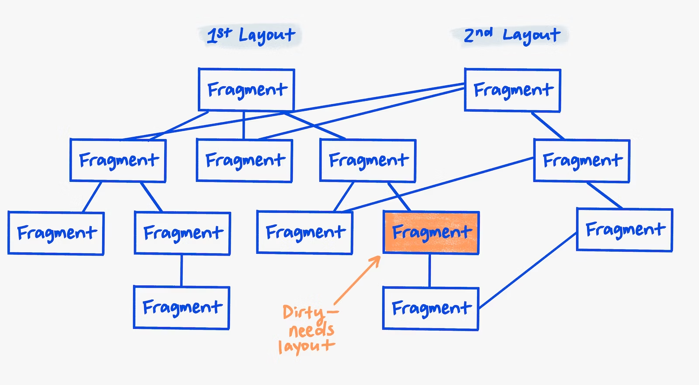

이 트리는 layout이 실행될 때마다 새로 생성되고 캐싱이 가능합니다. layout 과정의 출력인 변하지 않는 fragment 트리가 등장함으로써 입력과 출력이 분리된 잘 정의된 파이프라인으로 개선할 수 있었습니다.

**Reflow**  
성능 개선을 위해 Reflow와 Repaint를 감소해야 한다는 말은 많이 들으셨을 것입니다.
요소의 위치가 크기가 변경되는 레이아웃 과정에서 리렌더링이 발생하는 것을 Reflow라고 합니다.

#### Pre-Paint
Pre-paint에서는 실제로 화면에 그려지기 전에 다시 그려져야 할 요소를 결정합니다.

이전에 DOM 요소에 스타일을 연결하는 작업을 했지만 모든 스타일이 처리된 것은 아닙니다.
다음 속성들은 GPU 프로세스에서 직접 처리해야 합니다.
- transform
- opacity
- scroll
- clip

**Property Tree**  
위의 transform, opacity같은 속성이 있다면, 별도의 레이어를 만들어 Property Tree에 반영합니다.
이 Property Tree로 인해 레이어를 합칠 때 필요한 효과를 빠르게 적용할 수 있습니다.

이전에는 Property Tree에서 다뤄지는 데이터가 레이어에 함께 저장되어 있었기 때문에 변경된 요소의 하위까지 순회하면서 반영해야 했습니다.
최신 Blink 엔진에서는 이런 속성을 별도로 관리하고 각 노드에서는 Property Tree의 노드를 참조하는 방식으로 변경되었습니다.

Property Tree는 코어 웹 바이탈에서 CLS와 LCP 측정에 중요한 역할을 합니다.

**Paint Invalidation**  
또한 레이아웃 과정에서 dirty bit 시스템으로 계산 비용을 줄인 것처럼, paint 과정에도 dirty bit 시스템이 적용되어 있습니다.  
**스타일이 변경된 요소는 더티 요소가 되어, 캐싱해둔 paint 기록을 무효화합**니다. 이를 페인트 무효화(Paint Invalidation)라고 합니디.
불필요하게 그리는 비용을 줄이는 페인트 무효화 작업을 통해 스타일 계산 비용을 줄일 수 있습니다.

pre-paint는 앞서 style, layout 과정 중 재계산이 일어나서 dirty bit가 생겼으면 이 단계에서 캐싱된 이전 paint 기록을 무효화하는 작업도 수행합니다.

#### Paint
paint 과정은 실제로 화면을 그리는 과정이 아니라 어떻게 그려야 할지 계획하는 단계입니다.

Paint는 DOM의 배치 순서가 아니라 Stacking order(쌓임 맥락)에 따라 Fragment tree를 순회합니다.

각 레이어 객체는 `paint` 메소드를 가지고 있습니다
paint 메소드를 이용하여 Skia라는 그래픽 라이브러리의 `draw` 명령어를 생성합니다. 

또한 Property Tree도 paint 과정 때 사용됩니다. Property Tree는 레이어를 위한 개념이었는데 레이어는 paint도 독립적으로 실행될 수 있기 때문에 paint 덤프도 displayItem 속성으로 레이어마다 묶여서 나옵니다.

**Repaint**  
레이아웃이 변경될 때에는 Reflow가 발생하고, Reflow는 paint 단계에서 발생합니다.

> [Stacking order(쌓임 맥락)](https://developer.mozilla.org/en-US/docs/Web/CSS/CSS_positioned_layout/Understanding_z-index/Stacking_context)은 z-index와 같은 속성에 따라 렌더링 순서가 결정되는 개념입니다.  
> 참고: [Paint order](https://www.w3.org/TR/CSS2/zindex.html)

#### Layerize
Layerize는 어떤 DOM 요소가 자체 Graphics Layer에 들어갈지 파악하는 단계입니다.

Blink는 paint 과정의 결과인 `Paint Chunk`와 `displayItemList`들을 사용해서 `Composited Layer List`라는 데이터를 만듭니다.

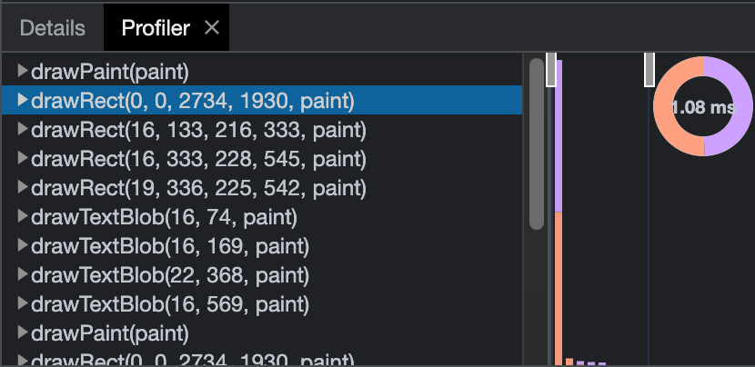

Paint Layer중 Compositing Trigger를 가지고 있거나 스크롤 가능한 컨텐츠가 있을 경우 별도의 Graphics Layer가 생성됩니다.

Compositing Trigger
- 3D 변형: translate3d, translateZ …
- `<video>`, `<canvas>`, `<iframe>` 요소
- position: fixed
- CSS 트랜지션과 애니메이션을 사용해 구현한 transform과opacity 애니메이션
- position: fixed
- will-change
- filter

### Renderer Process - Compositor Thread
메인 스레드 과정이 끝났고, 합성 스레드 단계가 시작됩니다.  
스레드가 분리되어 있으므로 메인 스레드가 바빠서 데이터를 요청할 수 없을 때에도 합성 스레드는 독립적으로 작동할 수 있습니다.  
예를 들어 클릭과 같은 유저 상호작용 이벤트가 발생합니다. 메인 스레드의 작업을 기다리지 않고도 합성 스레드는 이전에 commit된 작업들을 그릴 수 있습니다. 

합성 스레드는 메인 스레드와 별개로 레이어를 합성하고 사용자의 입력을 처리합니다.

#### Commit
이전 Layerize로 생성된 composited layer list는 pre-paint의 Property Tree와 함께 합성 스레드로 복사됩니다.

#### Tiling
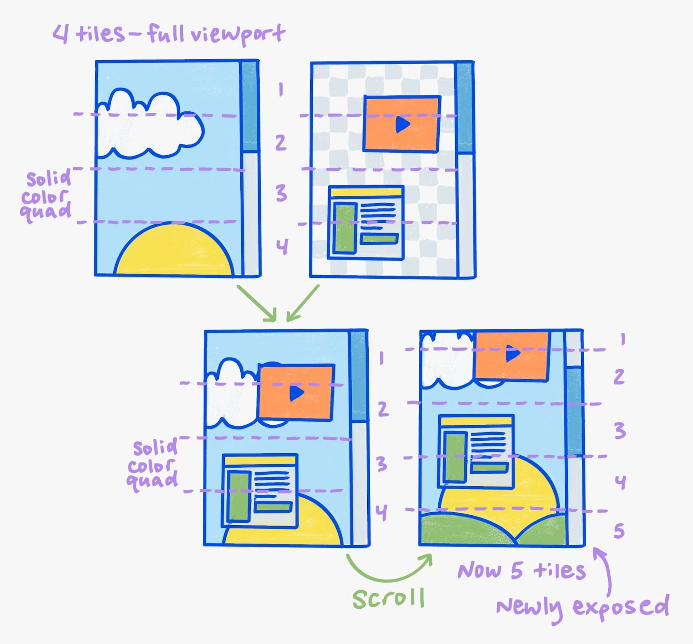

커밋을 한 후에 pending tree에서 받은 레이어를 더 작은 타일로 분할하는 작업입니다.
레이어의 크기가 클 수 있기 때문에 컴포지터 스레드는 레이어를 타일(tile)형태로 분할합니다. 타일로 쪼개면 변화가 생겼을 때, 레이어 하나를 크게 업데이트 하지 않아도 됩니다.
또한 뷰포트 밖에 있는 타일은 업데이트 하지 않아도 되서 불필요한 작업을 하지 않아도 됩니다. 

이 타일은 다음 Raster 단계의 작업 단위입니다.

각 타일에는 draw과정에서 생성한 PaintRecord가 포함되고, 각 타일은 화면을 벗어나지 않았는지(viewport 포함) 여부등에 따라 다른 우선순위로 래스터화 됩니다.

#### Raster

이제 쪼개진 타일들을 래스터화합니다.

렌더러 프로세스에서 메인 스레드와 GPU 프로세스가 나뉜 이유를 기억하시나요?

메인 스레드의 paint 과정은 실제로 화면을 그리는게 아니라, **그리기 위한 명령어를 생성**하는 과정이었습니다.
각 타일은 자신을 어떤 위치에 어떻게 그릴지에 대한 draw 명령어를 포함하고 있습니다. 

Raster는 이 draw 명령어를 실행하는 과정입니다.
Blink는 Skia라는 그래픽 라이브러리를 사용하여 비트맵 이미지를 생성하고 이를 GPU 메모리에 저장합니다.

**하드웨어 가속**
예전 크로미움 아키텍처에서 래스터 과정은 CPU 즉 Renderer 프로세스의 Raster 스레드에서 일어 났습니다. 요즘은 GPU의 그래픽 처리 연산이 좋아서 Raster 과정은 GPU 프로세스가 수행합니다. 이를 하드웨어 가속이라고 합니다.

**Quad**
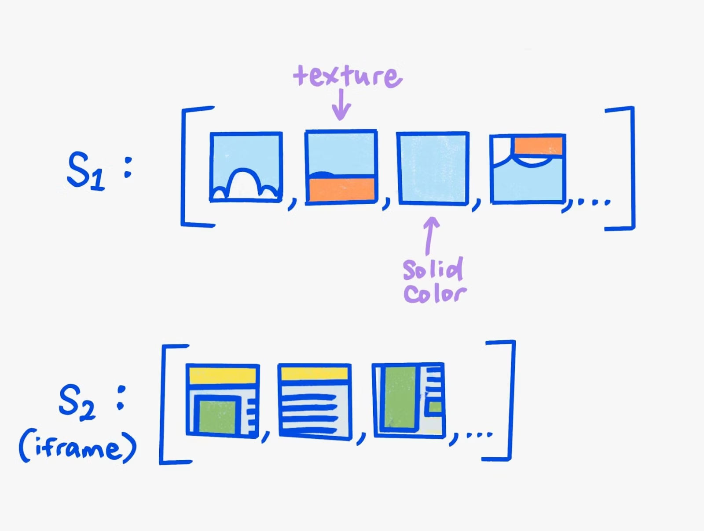

모든 타일이 래스터화 된 후 DrawQuad라는 명령어로 쿼드라는 데이터를 생성합니다. 쿼드는 타일을 웹 페이지 어디에, 어떻게 그릴지에 대한 정보를 포함하며, 이 정보는 앞에서 생성된 Property Tree를 바탕으로 생성합니다.

#### Activate
쿼드들을 하나로 묶어서 `Compositor Frame`이라는 데이터로 묶이고, GPU 프로세스로 전송합니다. 

### Viz Process

#### Aggregate
분할된 타일들은 쿼드로 묶이고, 최종적으로 쿼드는 `Compositor Frame`으로 묶어서 GPU 프로세스로 전송했습니다.

Aggregate는 집합이라는 뜻처럼 전송된 Compositor Frame들을 최종적으로 하나로 합치는 과정입니다. 

#### Draw
그리고 GPU 프로세스의 메인 스레드에 있는 그래픽 라이브러리 SKIA에 전달해 `DrawQuad`,`OpenGL`, `Vulkan` 같은 명령어를 실행합니다.
그러면 GPU가 화면에 픽셀을 그리면서 한 프레임이 제출되고 렌더링 파이프라인이 끝납니다.

## 마무리
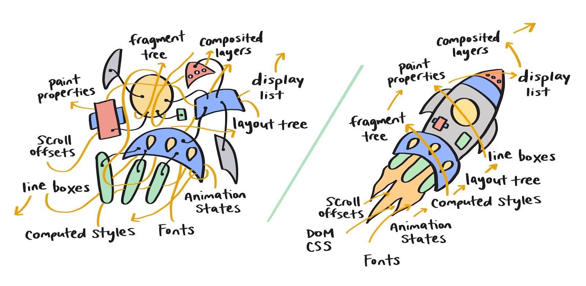

렌더링 파이프라인 성능 개선의 핵심은 핵심은 출력을 재사용한다는 것입니다.
출력은 각 작업(파이프라인)마다 생성되는 Fragment Tree, Property Tree 등을 말합니다.
작업마다 이전 출력을 이용해서 붙이고, 활용했습니다.

그림을 보면 출력들이 합쳐져 하나의 로켓을 완성합니다. 우리가 보는 웹 페이지 완성을 의미합니다.

그리고 스레드와 레이어를 분리해 장애 전파를 방지하고, 작업의 병렬성을 높이려고 한 점을 알 수 있었습니다.

**참고**
- [Life of a Pixel](https://docs.google.com/presentation/d/1boPxbgNrTU0ddsc144rcXayGA_WF53k96imRH8Mp34Y/edit#slide=id.ga884fe665f_64_802)
- [How Blink works](https://docs.google.com/document/d/1aitSOucL0VHZa9Z2vbRJSyAIsAz24kX8LFByQ5xQnUg/edit#heading=h.5bi68m3d1uqo)
- [Viz for WebView](https://docs.google.com/document/d/1s0cVEIvt8jrZpzAAHERWPSe_pjowum8RrCK1M00VzQA/edit)
- [RenderingNG deep-dive: LayoutNG](https://developer.chrome.com/articles/layoutng/)
- [RenderingNG deep-dive: BlinkNG](https://developer.chrome.com/articles/blinkng/#property-trees-consistent-geometry)
- [Key data structures and their roles in RenderingNG](https://developer.chrome.com/articles/renderingng-data-structures/)
- [Overview of the RenderingNG architecture](https://developer.chrome.com/articles/renderingng-architecture/#viz-process)
- [Chromium Blink와 렌더링 파이프라인](https://www.youtube.com/watch?v=_XTr2metxJg&t=821s)
- [브라우저 렌더링 파이프라인](https://www.youtube.com/watch?v=idgsruQl9f4)
- [렌더링 성능 개선 - 렌더링 과정 이해하기](https://so-so.dev/web/browser-rendering-process/)