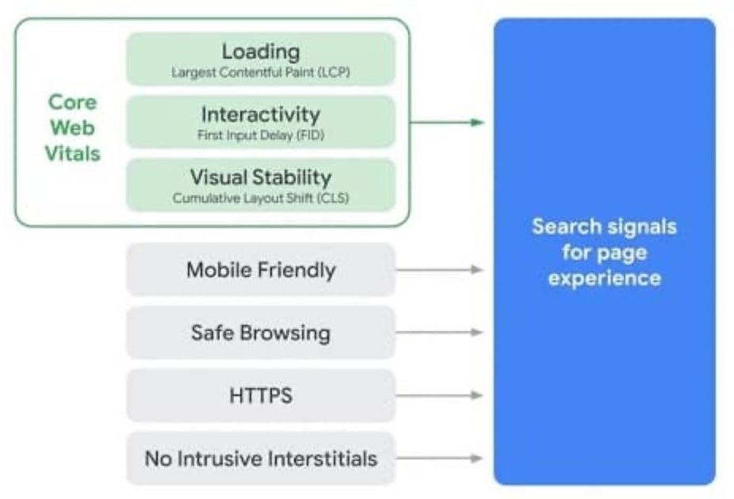
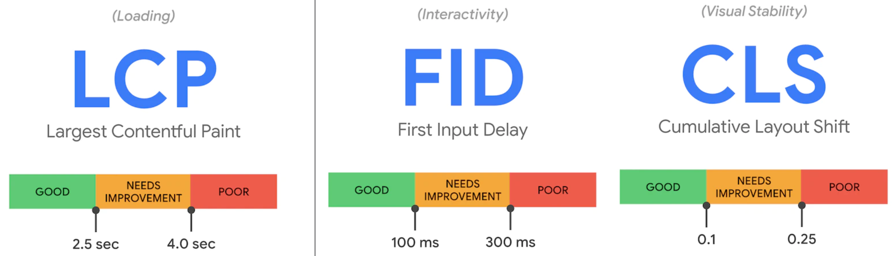
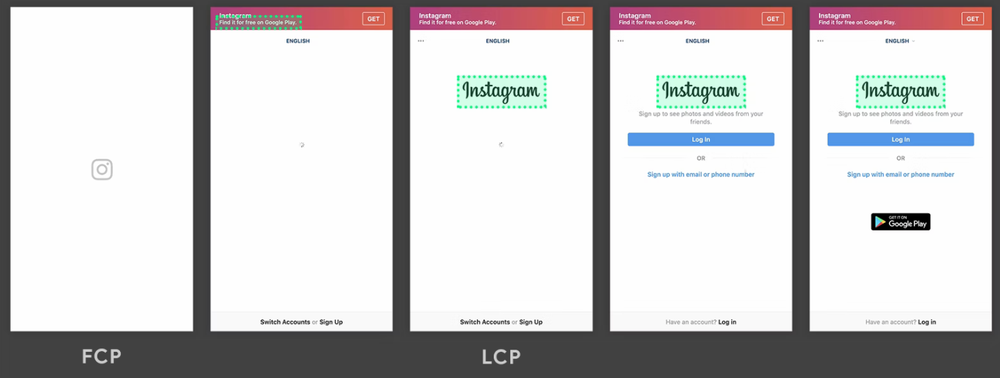
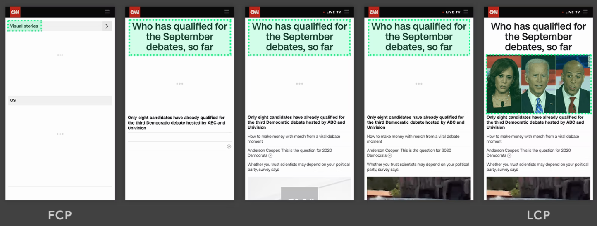
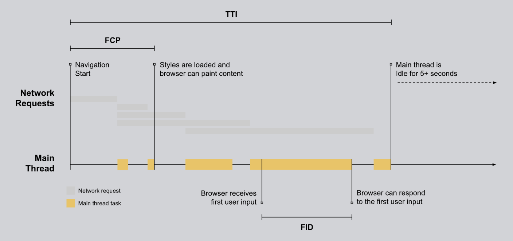
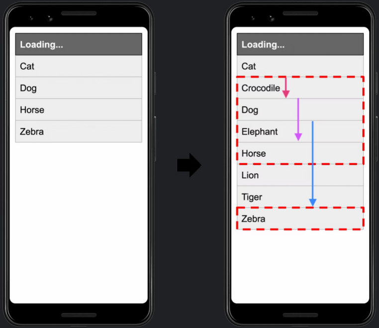

_어쩌고를 써야 메모리를 덜 먹어요. 저쩌고를 해야 성능이 최적화됩니다._

이게 좋다고 해서 적용했는데, 성능이 최적화 된 게 맞는지 **정량화된 수치**로 비교하고 싶었습니다.  
성능 개선의 기술에 앞서서 알아야 할 개념이 있습니다.  
**Core Web Vitals의 의미** 입니다.  
구글이 제시하는 지표들의 의미를 알아 보고, 이 지표들을 개선했을 때 실제로 **서비스에 유의미한 영향**이 있는 지도 확인해 보겠습니다.

## Core Web Vitals

코어 웹 바이탈은 로딩 속도, 모바일 친화성, https 제공 등과 같은 **사용자의 경험**에 영향을 미치는 부분들 중에서 구글이 중요하다고 강조하는 3가지 핵심 지표를 의미합니다.

3가지 핵심 지표(Maxtrix)들은 로딩 속도, 상호작용, 시각적 안정성으로 사용자 경험의 측면으로 구분됩니다.

- LCP - 로딩 속도
- FID - 상호작용
- CLS - 시각적 안정성

### LCP (Largest Contentful Paint)

로딩 속도에 대한 지표이며 다시 말하면 **주요 컨텐츠가 뷰포트에 로드될 때까지 걸리는 시간**입니다.
여기서 말하는 주요 컨텐츠란 뷰포트 내에서 볼 수 있는 이미지 또는 텍스트 블록을 의미합니다.

#### 예시

✅ 주요 컨텐츠가 로고 이미지일 때
인스타그램 로고가 초반에 먼저 로드되고, 나머지 콘텐츠가 로드된 후에도 가장 큰 요소로 로고가 남아 있습니다.

 

✅ 모든 콘텐츠가 로드 되면서 큰 요소가 변경되는 예

점진적으로 렌더링되면서 주요 컨텐츠가 텍스트 블럭에서 이미지로 변경됩니다.

### FID (First Input Delay)

웹 페이지와 사용자 간의 상호 작용에 대한 지표를 의미합니다.  
사용자가 웹페이지에 접속했고, 웹페이지에 버튼은 로드되었지만 로딩중인 상태입니다.  
이 때 사용자가 버튼을 클릭합니다. 버튼을 클릭한 것은 첫번째로 이벤트 발생이 되는 것이며, 아직 로딩중에 발생한 이벤트여서 브라우저는 이벤트 처리를 보류시킵니다.

`웹페이지 접속 → (로딩중) → 버튼 클릭(첫번째 이벤트 발생) -> 요청 보류`

즉, FID는 브라우저가 실제로 **첫번째 이벤트 핸들러 처리를 시작할 수 있을때까지**의 시간을 의미

위의 그래프에서 여러가지 지표의 발생시점을 확인할 수 있습니다.
처음 컨텐츠가 로드되는 시점인 FCP가 있고,  
사용자가 요청하는 모든 이벤트 핸들러 처리가 가능하게 되는 TTI 시간이 있습니다. FID는 FCP와 TTI 사이의 시간이 됩니다.

- FCP (First Contentful Paint): 흰 화면이 아닌 어떤 컨텐츠가 보이는 시점
- TTI (Time to Interactive): 페이지가 로드되기 시작한 시점부터 주요 리소스가 로드되고, 사용자가 안전하게 사이트를 이용하게 되기까지의 시간

### CLS (Cumulative Layout Shift)

페이지 컨텐츠의 시각적인 안정성에 대한 지표로 렌더링 될 때 요소가 시작위치에서 얼마나 변하는 지 측정하는 것을 의미합니다.

#### 예시

✅ 초기의 위치랑 어떻게 레이아웃이 틀어지는 지

점진적으로 렌더링되며 요소가 더 추가되어 Dog, Horse, Zebra의 위치가 변경됩니다.

✅ [사용자에게 부정적인 경험을 하게 하는 예시](https://web.dev/cls/)

위의 예시의 동영상을 통해 어떻게 사용자에게 부정적인 경험을 주는지 자세히 알 수 있습니다.  
사용자의 의도는 뒤로가기 버튼을 누르는 거였지만, 클릭하는 찰나 레이아웃이 틀어져서 사용자는 의도와는 다른 버튼을 클릭하게 됩니다.

### 측정 도구

지금까지 코어 지표들의 기본적인 개념이었습니다. 이 성능 지표들을 어떻게 측정해야 할까요?  
아래 2가지 도구로 측정할 수 있으며, 둘 다 구글에서 만든 툴입니다.

- 개발자 도구에 있는 Lighthouse
- [PageSpeed Insights](https://pagespeed.web.dev/)

> 💡 비슷한 결과가 나오는데 이 도구들의 차이점은 무엇일까요?
>
> 같은 도구여도 측정 시점마다 결과값이 다르게 나기도 하며, 측정 기준 또한 다릅니다. PageSpeed Insights는 최근 30일 이내의 보고서를 통해 측정한다고 설명되어 있습니다.

### 코어 웹 바이탈 개선 방법

개선 방법은 여러 가지가 있습니다.  
이 글의 목적은 자세한 개선 방법에 대한 내용은 아니기에 간략히 정리해 보겠습니다.

LCP는 로딩 속도를 의미하죠. 로딩 속도를 줄이기 위해서는 렌더링 방식을 SSR로 적용 한다거나,  
이미지나 웹폰트같은 에셋들의 크기를 줄여야 합니다.  
LCP 리소스들을 빨리 로드시키기 위해 요소에 우선순위를 부여하는 `fetchpriority` 속성도 존재하는데, 아직 적용은 해보지 못했습니다.

CLS는 렌더링되면서 레이아웃이 최대한 유지되도록 해야 합니다. 최대한 브라우저가 repaint되는 것을 줄여야 합니다.  
그래서 이미지 크기를 고정시키거나 스켈레톤 UI를 적용하는 방법이 있습니다.

상호작용을 의미하는 FID는 자바스크립트 파일의 크기를 축소하고 실행 시간을 단축시켜야 합니다.  
당연한 내용이겠고, 어떻게 해야 할 지가 어려운 부분인 것 같습니다.

- LCP
  - SSR
  - 이미지 형식 변경, 이미지 크기 축소, 웹폰트 크기 줄이기
  - LCP 리소스들을 가능한 빨리 로드시키기 위해 요소에 우선순위를 부여하는 `**fetchpriority**`속성 추가
    ``
  - [LCP 최적화 상세](https://web.dev/optimize-lcp/)
- FID
  - 자바스크립트 크기 줄이기
  - [FID 최적화 상세](https://web.dev/optimize-fid/)
- CLS
  - 이미지에 항상 크기 지정
  - [CLS 최적화 상세](https://web.dev/optimize-cls/)

### 진짜 효과가 있나?

이 지표들을 개선했을 때, 실제로 rakuten이나 미국 맛집 어플인 yelp 등 여러곳이 트래픽이 올라가고,  
구매전환율이 올라가는 비즈니스적으로 긍정적인 효과가 있었다고 합니다.

[링크](https://web.dev/tags/case-study/)에서 더 많은 사례를 확인할 수 있습니다.

---

공부하면서 퍼포먼스 탭에서도 어떻게 성능을 측정하는 지 알아볼 수 있었습니다.  
이후에 자세한 성능 측정 방법과 개선에 대해 알아보고 글을 작성하겠습니다!

### 참고 아티클

- [web.dev LCP 최적화 상세](https://web.dev/optimize-lcp/)
- [web.dev FID 최적화 상세](https://web.dev/optimize-fid/)
- [web.dev CLS 최적화 상세](https://web.dev/optimize-cls/)
- [Lighthouse 성능 지표를 사용한, '웹 애플리케이션 성능 측정 자동화 모듈' 개발기](https://www.youtube.com/watch?v=34T0IU18R6c)
