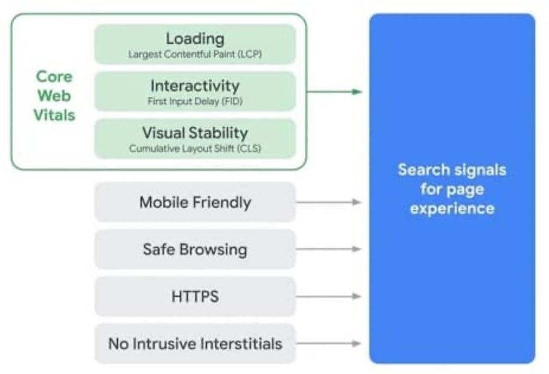
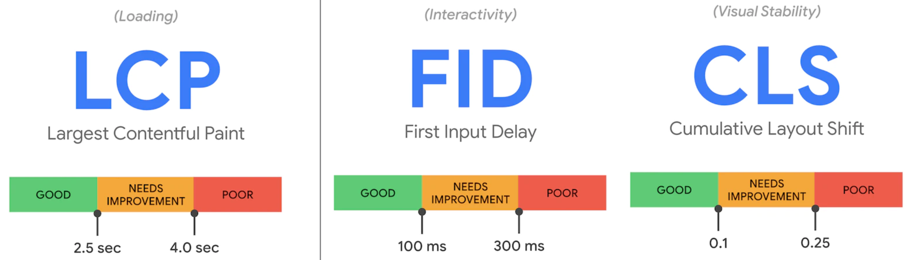
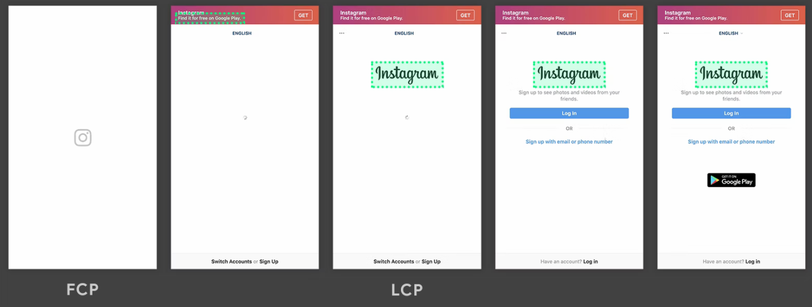
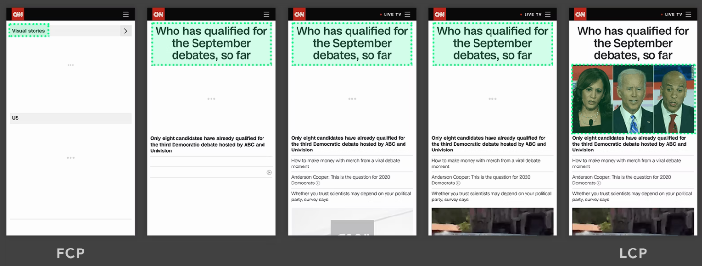

성능 최적화를 위한 방법이 많은데요.  
실제로 적용했을 때, 빨라진 것 같다라고 느낌으로 알기 보다 **정량화된 수치**로 비교하고 싶었습니다.  
성능 개선에 앞서서, **Core Web Vitals 지표들의 의미**에 대해 알아보려고 합니다.  
그리고 구글이 제시하는 지표들을 개선했을 때 실제로 **서비스에 유의미한 영향**이 있는 지도 확인해 보겠습니다.

## 목표

- 코어 웹 바이탈스 값들의 의미를 알아본다.
- Lighthouse와 PageSpeed Insights를 이용해 웹 성능 측정을 해본다.
- 측정 결과를 통해 성능이 저하되는 시점이 언제인지 파악한다.

## Core Web Vitals

코어 웹 바이탈은 로딩 속도, 모바일 친화성, https 제공 등과 같은 **사용자의 경험**에 영향을 미치는 부분들 중에서 구글이 중요하다고 강조하는 3가지 핵심 지표를 의미합니다.

이 지표(Matrix)들은 사용자 경험의 관점에서 구분됩니다.

- LCP - 로딩 속도
- FID - 상호작용
- CLS - 시각적 안정성

### LCP (Largest Contentful Paint)

- 로딩 속도에 대한 지표
- 주요 컨텐츠가 뷰포트에 로드될 때까지 걸리는 시간

> 💡 주요 컨텐츠는 뷰포트 내에서 볼 수 있는 이미지 또는 텍스트 블록을 의미합니다.

#### 예시

- 주요 컨텐츠가 로고 이미지일 때
  

- 모든 콘텐츠가 로드 되면서 큰 요소가 변경되는 예
  - 주요 컨텐츠: 텍스트 블럭 → 이미지
    

### FID (First Input Delay)

- 웹 페이지와 사용자 간의 상호 작용에 대한 지표
- 사용자가 웹페이지 접속 → (로딩중) → 버튼 클릭(첫번째 이벤트 발생)
  - 로딩중에 발생한 이벤트 처리를 브라우저는 보류시킴
- 즉, FID는 브라우저가 실제로 첫번째 이벤트 핸들러 처리를 **시작할 수 있을때까지**의 시간을 의미
- 타임라인: TTI와 FCP 사이의 시간
  

<aside>
💡 **FCP(First Contentful Paint)**
흰 화면이 아닌 어떤 컨텐츠가 보이는 시점

**TTI(Time to Interactive)**
페이지가 로드되기 시작한 시점부터 주요 리소스가 로드되고, 사용자가 안전하게 사이트를 이용하게 되기까지의 시간

</aside>

### CLS (Cumulative Layout Shift)

- 페이지 컨텐츠의 시각적인 안정성에 대한 지표
  - 렌더링 될 때 요소가 시작위치에서 얼마나 변하는 지 측정

#### 예시

- 점진적으로 렌더링되며 요소가 더 추가되어 Dog, Horse, Zebra의 위치가 변경
  
- [사용자에게 부정적인 경험을 하게 하는 예시](https://web.dev/cls/)

### 측정 도구

아래 2가지 도구로 성능 지표를 측정할 수 있으며, 둘 다 구글에서 만든 툴입니다.

- Lighthouse
- PageSpeed Insights

#### 차이점

#### 프립 웹 성능 측정해보기

1. 크롬 개발자도구 → Lighthouse 탭
2. 카테고리, 디바이스 선택
3. Lighthouse 검사 결과 확인
   - 웹 바이탈 지표 값
   - 개선 가이드
4. [PageSpeed Insight](https://pagespeed.web.dev/) 검사를 통해 비교
5. 상세한 시점과 내용을 알고 싶으면 Performance 탭에서 확인
   - [LCP에 대한 상세 내용은 Performance Insights 탭에서 확인](https://developer.chrome.com/blog/new-in-devtools-105/?utm_source=devtools#insights)

FCP

LCP

### 코어 웹 바이탈 개선 방법

- LCP
  - SSR
  - 이미지 형식 변경, 이미지 크기 축소, 웹폰트 크기 줄이기
  - LCP 리소스들을 가능한 빨리 로드시키기 위해 요소에 우선순위를 부여하는 `**fetchpriority**`속성 추가
    ``
  - [LCP 최적화 상세](https://web.dev/optimize-lcp/)
- FID
  - 자바스크립트 크기 줄이기
  - [FID 최적화 상세](https://web.dev/optimize-fid/)
- CLS
  - 이미지에 항상 크기 지정
  - [CLS 최적화 상세](https://web.dev/optimize-cls/)

### 진짜 효과가 있나?

이 지표들을 개선했을 때, 실제로 rakuten이나 미국 맛집 어플인 yelp 등 여러곳이 트래픽이 올라가고,

구매전환율이 올라가는 비즈니스적으로 긍정적인 효과가 있었다고 합니다.

[https://web.dev/tags/case-study/](https://web.dev/tags/case-study/)

### 참고 아티클

- [https://web.dev](https://web.dev/optimize-fid/)/
- [Lighthouse 성능 지표를 사용한, '웹 애플리케이션 성능 측정 자동화 모듈' 개발기](https://www.youtube.com/watch?v=34T0IU18R6c)
