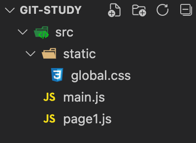
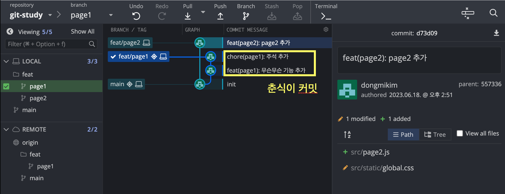
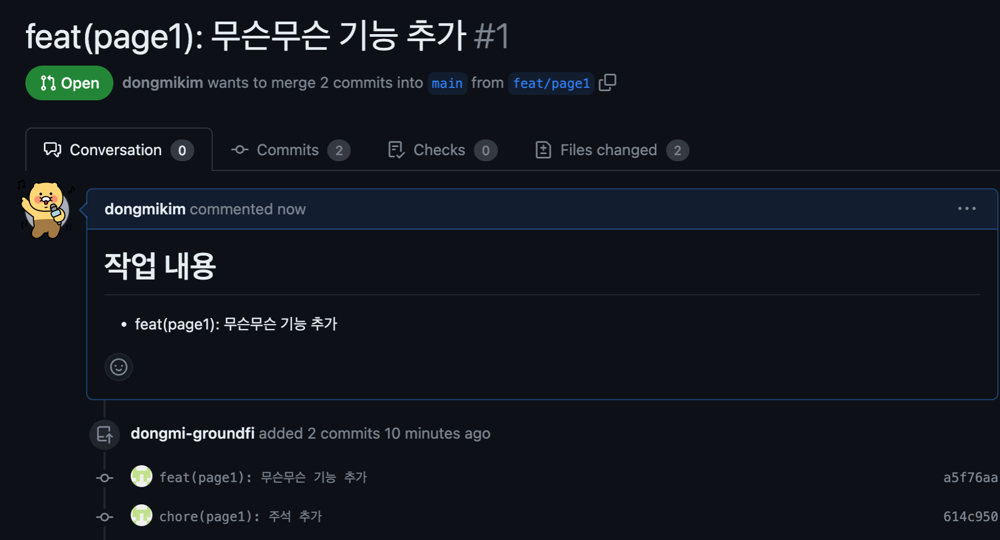
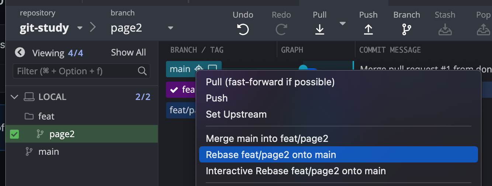
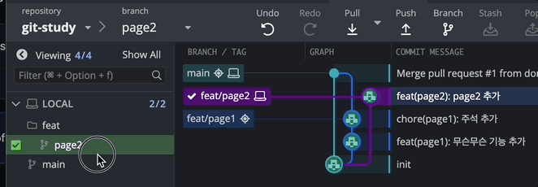
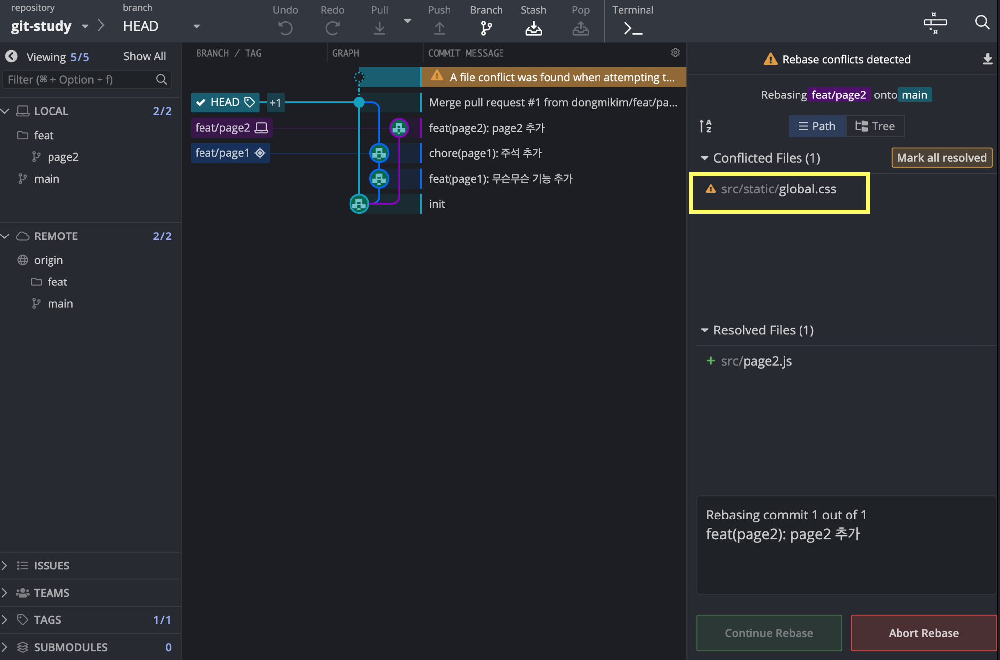
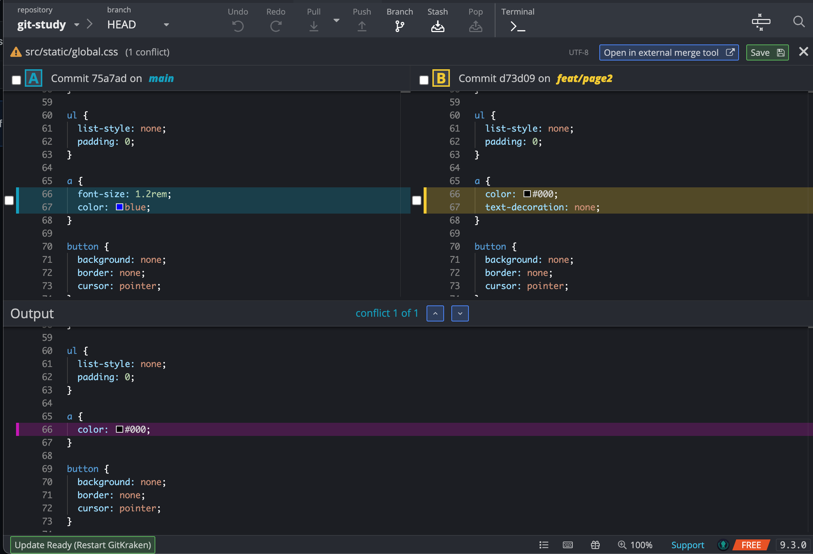
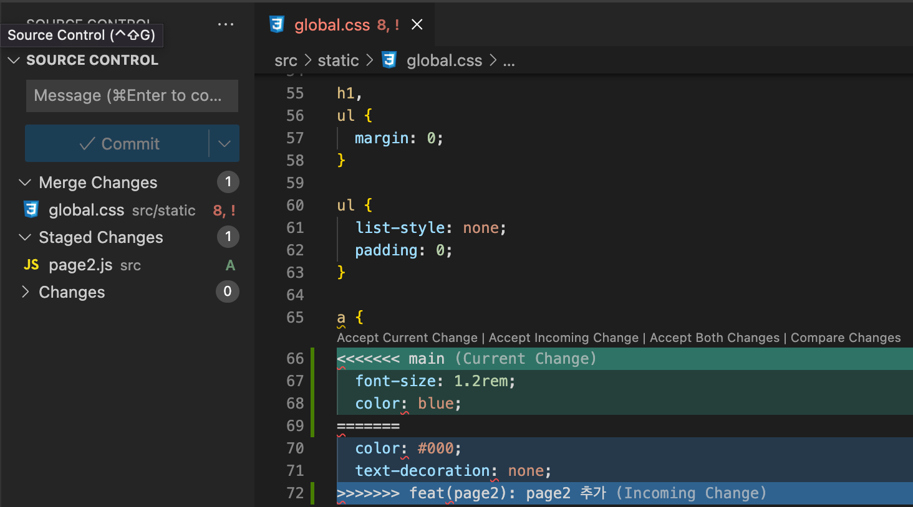
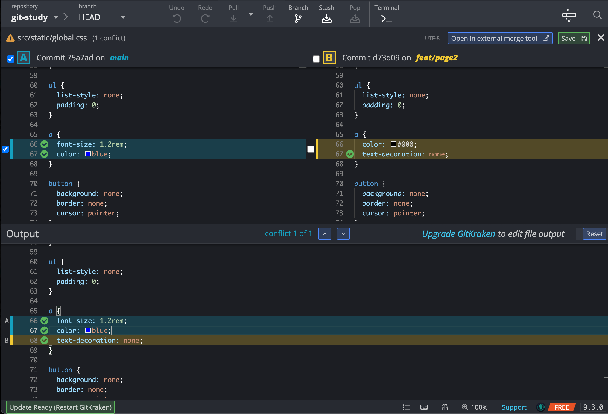

## 🦑 GitKraken

GitKraken은 Git GUI 도구다.  
브랜치 흐름이 시각화되어 있어서 여러 명이 동시에 작업하는 경우에도 브랜치 간의 관계를 이해하기 쉽다.  
터미널로 명령어를 입력하는 방법보다 직관적으로 작업을 수행할 수 있다.

VScode에도 git extension이 있지만 GitKraken을 쓰다 보면 정말 편하다.  
아직 Git을 이용한 Workflow가 낯설다면 터미널보다 GitKraken으로 익숙해지면 좋을 것 같다.

## 🚀 Merge 하기 전에 충돌 막기

가상의 개발팀을 조직하여 협업을 진행하겠다.
나와 춘식이가 작업을 해야 한다.

**프로젝트 디렉토리**

**작업 내역**

- 춘식이는 page1 수정을 해야 한다.
- 나는 page2를 신규로 생성해야 한다.

**작업 시나리오**

1. 각자 마스터 브랜치인 `main`에서 브랜치를 딴다.

   

- 춘식: `feat/page1`
- 나: `feat/page2`

  vscode에서 브랜치를 직접 생성해도 되지만,  
   GitKraken에서 브랜치 흐름을 보고 상단에 branch 아이콘을 클릭해서 생성할 수도 있다.

2. page1 작업은 범위가 크지 않아 먼저 끝났다. 춘식이는 PR을 생성한다.

   

3. 춘식이의 작업은 머지된다. `feat/page1 -> main`

4. 나도 작업이 완료됐다.  
   춘식이의 작업 내역을 보니 Conflict이 발생할 것 같다.
   둘 다 `global.css`를 수정했기 때문이다.

현재 나에게는 춘식이가 수정한 css 코드가 없다.

그대로 내가 merge 하게 되면 춘식이의 css 코드가 날아갈 수 있다.  
굉장히 당혹스럽고 귀찮아지게 된다.

### 🔑 Rebase

Rebase는 브랜치를 합치는 것이다.
간단히 말하면 merge는 여러 브랜치를 하나로 통합하는 작업이다.

반면 Rebase는 브랜치의 시작 지점을 변경해 다른 브랜치의 커밋들을 가져오기 위해 사용한다.  
커밋 히스토리가 변경되면서 내 커밋 바로 아래로 리베이스한 브랜치의 커밋들이 정렬된다.

춘식이의 코드는 이미 main 브랜치에 머지된 상태다.  
그래서 나는 PR을 올리기 전에 main 브랜치를 rebase 해야 한다.

1. 로컬 `main`을 pull 받아서 최신화한다.
2. 다시 작업중인 브랜치(`faet/page2`)로 체크아웃한다.

3. main브랜치를 rebase한다.

   

   그래프에서 우측 클릭으로 리스트에서 선택할 수도 있다.

   

   아니면 디렉토리 뷰에서 드래그앤드랍도 가능하다.

### 😱 Conflict 해결하기

예상했던 대로 `global.css`에서 충돌이 발생했다.

1. 충돌 파일 선택
   Conflicted Files에서 `global.css`를 선택한다.

    

   왼쪽은 main에 머지된 춘식이의 작업이고,
   오른쪽은 내가 작업한 코드다.

   이제 Output을 보면서 충돌을 해결하면 된다.
   Output에서 보이는 코드대로 머지되기 때문이다.

    

   vscode에서는 이렇게 보이는데,
   gitKraken 화면이 가시성이 훨씬 좋다.

2. Merge할 코드 선택

   

   왼쪽과 오른쪽 내역에서 체크한 코드들이 아웃풋에 반영된다.

   확인하고 우측 상단의 Save를 클릭하면 완료!

   이제 충돌 걱정없이 remote로 Push하고 PR을 생성하면 된다.
