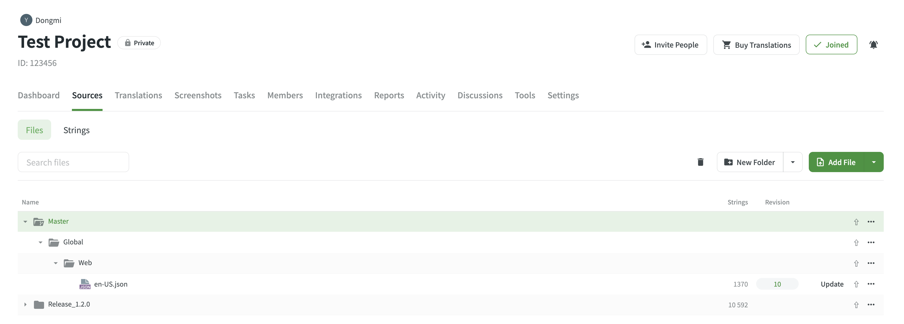
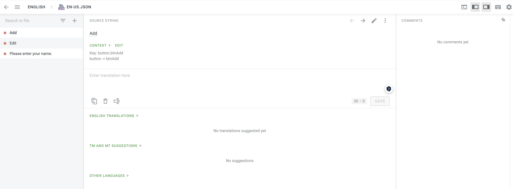

현재 회사에서 개발하는 제품은 12개의 언어를 제공하는 글로벌 서비스입니다.

다국어 개발 자체로는 난이도가 높지 않지만 번역가, PM님들과 소통하며 적용하기는 다른 영역이었습니다.  
서로 관점이 달라서 같은 용어지만 다른 의미로 사용해 혼란이 생겼습니다. 다국어 관리를 하는 방식도 달라서 공통화하는 논의도 많이 필요했습니다.

비슷한 고민을 하는 분들에게 도움이 되었으면 해서, 지금까지 제가 경험해온 다국어 프로세스를 정리합니다.

먼저 개발자 사이드의 다국어 관리 방식과 번역 플랫폼을 이용한 관리 방식을 비교하고,
번역 플랫폼 Crowdin을 통한 다국어 프로세스에 대해 공유하겠습니다.

## i18n

다국어 개발이라고 하면 떠오르는 i18n (internationalization, 국제화)입니다.  
i18n은 i와 n 사이에 18개의 문자가 있다는 뜻이며 다양한 언어에 맞도록 설계하는 과정입니다.

그래서 개발자들은 i18n을 지원하는 라이브러리를 통해 서비스가 다국어를 지원하도록 합니다.

## 기본적인 다국어 작업

공통적으로 다국어는 json이나 csv 파일에서 key와 string으로 관리합니다.  
언어 별로 공통 key를 사용하고, 다른 번역 스트링을 매치합니다.

**예시**

**_ko-KR.json_**

```json
{
  "btnAdd": "추가"
}
```

**_en-US.json_**

```json
{
  "btnAdd": "Add"
}
```

`btnAdd`가 key가 되고, 그 뒤에 문자열이 스트링이 됩니다.  
 (문자열과 스트링은 같은 말이지만 보통 스트링으로 부르고 있습니다.)

그리고 i18n을 제공하는 라이브러리를 사용해 실제로 개발에서 번역되도록 합니다.

## 개발자가 관리하는 다국어 프로세스

이전 회사에서는 한국어, 영어, 일어의 다국어 개발을 했습니다.  
이 프로젝트의 다국어 작업은 어렵지 않았고, 개발자의 단순 노가다력만 필요했습니다.

프로젝트 초반에만 전문 번역가에 맡긴 번역 스트링들을 전달 받았고,  
이후에는 개발자가 구글 번역을 돌려서, json 파일에다가 복붙하는 방식이었습니다.

**오직 개발자만 번역을 관리하는 방식**이었습니다.

글로벌 서비스인데 이렇게 허술하게 관리하나 싶으실 것 같습니다.
프로덕트는 점점 한국 타겟으로만 서비스 업데이트가 진행되서 다른 언어는 아무도 신경쓰지 않았습니다 😂
실상 다국어 적용이 필요하지 않게 되었죠..

### 문제

실제 글로벌 서비스에서 개발자가 번역 스트링을 관리하면 어떤 문제가 있을까요?

- 번역할 단어가 많아지는 경우
  -> 번역가에 제공받은 번역 스트링을 하나하나 복붙해야 하는 작업 비용이 엄청 높습니다.
- 제공하는 언어가 많은 경우
  -> 스트링도 많은데, 언어 별로 관리하는 포인트가 또 늘어나겠습니다.
- 코드에서 스트링 관리하는 경우
  -> 이 스트링이, 저 스트링같고 보기 힘들고 관리가 어렵습니다.

정말 휴먼 에러가 발생하지 않는게 신기하겠네요.

기능의 업데이트에 따라 삭제되고 추가되는 스트링들이 많을텐데요.  
이 방법은 번역가, 개발자 모두에게 괴롭겠네요..

## 개발자와 Writer 협업 다국어 프로세스

현재 회사는 Writer님들이 UX Writing과 영문 번역을 담당하고 있습니다.  
(그 외 언어 번역은 외주)

그래서 실제로 다국어에 대한 관리는 Writer님들이 하고 있습니다.

현재 협업 과정은 간략하게 이렇습니다.

1. 스펙 문서에 PM이 추가,삭제되는 스트링을 정의합니다.
2. 개발자는 스펙 문서를 통해 스트링에 맞는 key를 정의합니다.
3. 이 string과 key를 전달하면 writer에게 전달하면 회사의 도메인과 기능의 문맥에 맞게 영문으로 번역됩니다.  
   영문은 번역의 기준이 되는 언어입니다. 기준이 되는 언어는 소스 스트링(Source String)입니다.  
   다시 말해 소스 스트링은 영문입니다.
4. 영문 번역을 기준으로 다른 언어들도 번역이 진행됩니다.
5. 번역이 완료되면 개발자에게 전달됩니다.

크게 이렇게 5가지의 단계로 진행됩니다. (더 자세한 과정은 아래에서 다룹니다.)

이제 중요한 점은 번역을 어떻게 진행하고, 서로 업데이트를 주고 받느냐 입니다.  
구글 스프레드 시트를 사용해 자동화하는 방법도 있더라구요. 저희는 Crowdin을 이용하고 있습니다.

### Crowdin

크라우딘은 번역 플랫폼입니다.

번역가들은 개발 파일에는 접근하지 않습니다. 오직 크라우딘을 이용해 번역과 검수를 진행하고, 스트링 관리를 합니다.

개발자는 크라우딘에서 스트링을 건드리지 않습니다.  
번역이 완료되었다고 전달받으면 크라우딘의 번역 파일들(en-US.json 등)을 개발 코드로 다운로드 받기만 합니다.
언어 별로 번역 스트링을 복붙하는 작업은 하지 않습니다.

### 협업 프로세스

크라우딘 화면도 살펴 보면서 더 자세한 프로세스를 알아 보겠습니다.



크라우딘은 브랜치를 나눠서 스트링을 관리할 수 있습니다. Source 탭에서는 브랜치 폴더를 확인할 수 있습니다.  
Master는 무조건 있어야 하는 메인 브랜치입니다.  
그 외 브랜치를 생성해서 버전 관리를 할 수 있습니다.

> **크라우딘 Master 브랜치 특징**  
> 마스터에 있는 스트링은 삭제되어도 번역 백업이 됩니다.  
> 이 기능을 TM(Translate Memory)이라고 합니다.



브랜치 폴더를 열면 소스 스트링이 보입니다.

**_en-US.json_** 파일로 이동하면 좌측에 스트링 목록이 있습니다.

우측에선 스트링의 key 값과 소스 스트링, 번역을 입력할 수 있습니다.

Context는 이 스트링에 대한 문맥을 알 수 있는 내용을 추가합니다. 이미지도 추가할 수 있습니다.

크라우딘 내부 화면에 대해 간단히 설명드렸습니다.  
이 내용을 기반으로 협업 프로세스에 대해 다시 살펴보겠습니다.

1. 스펙을 확인한 개발자는 작업이 필요한 스트링을 파악합니다. (기존 스트링 활용이 가능 여부)  
   소스 스트링 파일인 영문 json 파일에 key를 추가합니다.  
   key 와 매치되는 문자는 스펙에 있는 스트링을 넣든, 임의로 개발자가 작성합니다.

```json
{
  "btnAdd": "Add",
  "btnEdit": "Edit",
  "msgValidPassword": "Please Enter a password"
}
```

2. 소스 스트링 파일을 크라우딘에 업데이트하고, 번역가에게 전달합니다.  
   (필요하다면 개발자가 스크린샷을 추가해서 다국어 문맥(Context) 에 대한 정보를 전달할 수 있습니다.)

3. 소스 스트링 먼저 번역과 검수가 시작됩니다.

4. 검수까지 완료되면 다국어 번역이 시작됩니다.

5. 다국어 번역까지 완료되면 크라우딘에 번역 파일들을 다운로드 받습니다.

이 과정에서 개발자는 영문 파일 하나에서 key만 관리하면 됩니다.

### 문제

개발자는 key만 추가하고, 업데이트 된 내용은 다운로드 받기만 하면 되니 굉장히 편합니다.  
게다가 스트링도 번역가 분들이 번역 플랫폼에서 관리하기도 편할 것 같습니다.

그렇지만 하나의 파일이 한 곳을 바라보며 작업되는게 아니라, 나눠져서 작업됩니다.  
소스 스트링 파일은 개발자는 코드, 번역가는 크라우딘에서 관리합니다.
다시 말해 **파일은 하나인데, 관리는 두 곳에서 이루어지게 됩니다.**

예를 들어 번역가가 크라우딘에서 번역을 진행하고 있습니다.  
번역 검수 도중에 개발자가 소스 스트링 파일에 수정이 생겨 업데이트를 진행합니다.  
그러면 진행되던 번역이 날아가게 됩니다.

번역가는 날아간 번역들을 다시 채워넣어야 하고, 검수를 다시 해야하게 됩니다.

이렇게 파일이 엎어 쳐지는 일이 반복되면, 했던 일을 또 해야 되는 시간 비용이 발생합니다.
또한 외주 번역을 맡겼을 경우 재번역이 필요하고 정산 이슈가 발생할 수 있습니다.

번역가는 했던 일을 다시 해야 되면서 휴먼 에러가 발생할 수 있습니다. 개발 사이드 또한 마찬가지입니다.
이렇게 되면 크라우딘을 이용하는 의미가 없습니다.

### 해결

소스 스트링 검수, 번역이 진행되는 도중에 개발자는 크라우딘에 업데이트를 하지 않습니다.

파일이 자동으로 동기화되지 않으므로, **업데이트 = 파일 덮어쓰기**가 되므로 협의가 되면 진행하기로 했습니다.

배포 브랜치에 merge가 될 때, 크라우딘 업데이트가 자동으로 되도록 action이 설정됐었습니다.
현재는 그 action을 껐고, 수동으로 업데이트를 진행합니다.  
계속 검수 완료된 스트링들이 날아가는 등의 이슈가 있었기 때문입니다.

현재는 번역 완료에 대해 전달받으면, 다국어를 다운로드 받고 다시 업데이트 하는 등의 방식으로 진행하고 있습니다.

## 마무리

번역가들과 협업이 많은 다국어 서비스를 개발한다면 번역 플랫폼을 이용하는 방법도 좋을 것 같습니다.

Crowdin API를 이용해 action을 설정하면서 문의를 드린 적이 있는데요.
답변도 빠르고, 친절하시더라구요.

그러다가 Crowdin API 버그를 발견해서 개발자 분이 수정해주시기도 했습니다!  
크라우딘의 자체 버그인지도 모르고 계속 삽질했었는데요.  
 항상 버그는 어디에나 있으며, 공식 문서가 틀릴 수도 있음을 깨달을 수 있었습니다 :)
