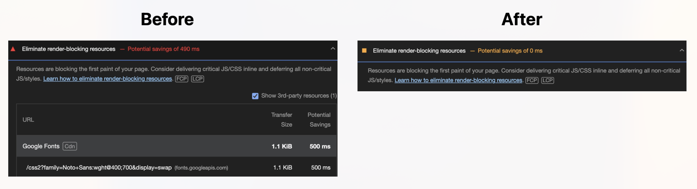
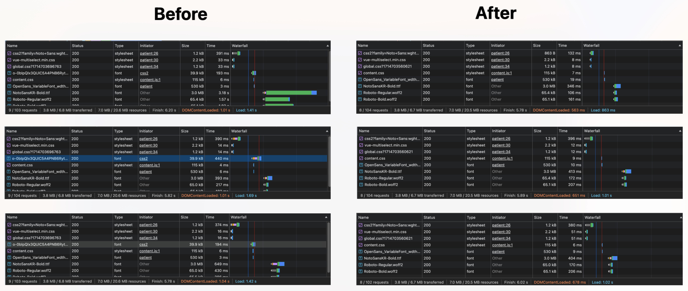

회사 프로덕트를 Lighthouse로 검사했을 때, 웹폰트가 Render-blocking 요소로 진단되어 개선해 보았습니다.  
단 한 줄의 코드 추가로 이 문제를 해결하고, 동시에 로드 시간을 약 0.7초 단축할 수 있었습니다.

## 기존 코드

```html
// index.html
<head>
  // ...
  <link
    href="https://fonts.googleapis.com/css2?family=Noto+Sans:wght@400;700&display=swap"
    crossorigin
    rel="stylesheet"
  />
</head>
```

웹폰트를 로드하는 기존 코드입니다.

- Noto Sans 웹폰트: Google의 CDN을 통해 로드되고 있습니다.
- `crossorigin` 속성: 이 속성을 사용하여 CORS 요청을 활성화합니다. 명시하지 않을 경우, CORS 요청이 불가능합니다.
- `display=swap`
  - `font-display` 속성은 웹폰트의 로딩 전략을 설정하는 API입니다.
  - `swap` 옵션을 사용하면 초기 렌더링 시 시스템 폰트를 사용하고, 웹폰트 로딩 후에는 이를 대체합니다, 이로써 렌더링 지연을 최소화합니다.

## 고려된 개선 방법

### 1. CDN → 자체 호스팅

처음에는 자체 호스팅을 통해 로드 속도를 개선하고자 했습니다. 그러나 CDN과 자체 호스팅의 성능 차이를 검토한 결과, CDN을 유지하는 것이 더 나은 선택이었습니다.

**CDN**  
CDN을 사용하면 웹폰트 로딩 속도가 네트워크 상황에 따라 달라질 수 있습니다. 특히, CDN 서버에 문제가 발생하면 폰트 로딩이 중단될 수도 있습니다.  
([최근 `jsdelivr` 라이브러리 CDN 서버가 다운되면서 사용자들을 당황시킨 이슈가 있었습니다.](https://github.com/jsdelivr/jsdelivr/issues/18565))

그러나 웹폰트가 이미 캐싱되어 있다면 중복 다운로드를 방지하여, 로딩 속도 개선에 효율적인 장점이 있습니다.

[A.com](http://a.com/)과 [b.com](http://b.com/) 모두 구글CDN을 이용한다고 가정하면. [A.com](http://a.com/)에 접속했을때 구글 CDN 웹폰트를 한 번 다운받을경우,  
B사이트에 접속하더라도 [A.com](http://a.com/) 접속시 이미 다운로드된(브라우저상에 캐싱된) 웹폰트를 이용하므로 속도가 더 빠릅니다.

Google Web Font CDN은 워낙 범용적이므로 캐싱되어 있을 확률이 높습니다.
또한 구글 폰트는 브라우저 성능에 따라 작은 폰트 파일을 전달하는 최적화 로직도 포함하고 있습니다.

**자체 호스팅**  
이 방법은 사용자가 웹사이트를 방문할 때마다 폰트 파일을 다운로드해야 하므로, CDN보다 비효율적일 수 있습니다.

자체 호스팅은 인터넷 연결없이 사용하거나 데이터 보호 규정을 고려해야 한다면 선택할 수 있습니다.
(Google Fonts가 사용자 데이터를 수집하므로 EU의 일반 데이터 보호 규정(GDPR) 요건을 충족하지 못함)

따라서 매번 로드해야 되는 자체 호스팅보다 CDN이 적절합니다.

### 2. Subset Font  
Subset Font는 사용되지 않는 문자를 포함하지 않아 파일 크기를 줄이는 방법입니다.

하지만 다양한 국가에 서비스를 제공하는 프로덕트이므로 문자 선별 작업에 대한 효과가 크지 않아 이 방법은 제외되었습니다.

### 3. 폰트 프리로드  
브라우저에게 폰트 파일을 미리 로드하도록 지시하여, CSS 파일이 렌더링 차단 리소스로 작용하는 것을 막을 수 있습니다.

```html
<link
  rel="preload"
  href="https://fonts.googleapis.com/css2?family=Noto+Sans:wght@400;700&display=swap"
  crossorigin
/>
```

## 선택한 개선 방법

CDN을 사용할면서 폰트의 우선순위를 높이기 위해 preload 옵션을 통해 웹폰트를 미리 로드하도록 설정했습니다.

### preload 적용하기 
  
**as**  
preload를 설정할 경우, `as` 속성은 필수입니다. `as="style"`로 설정하여 CSS 파일임을 명확히 합니다.  
`as`는 로드할 콘텐츠 타입을 의미합니다. 명시하지 않으면 리소스를 가져오지 않습니다.

**crossorigin**
`crossorigin`은 반드시 포함되어야 합니다.

**onload**
```html
<link rel="preload" as="style" href="https://fonts.googleapis.com/css2?family=Noto+Sans:wght@400;700&display=swap" crossorigin onload="this.onload=null;this.rel='stylesheet'">
```
`onload` 핸들러를 통해 폰트 스타일시트가 로드되면 `rel` 속성을 `stylesheet`로 변경해줘야 브라우저에서 폰트가 적용됩니다.
 
 참고: https://web.dev/articles/defer-non-critical-css?hl=ko

> **rel**
> - 현재 페이지에서 반드시 사용되는 리소스는 `preload` 합니다.
> - 외부 도메인의 리소스는 `preconnect` 합니다.
> - 미래에 사용되는 리소스는 `prefetch` 합니다.


## 결과
환경 (Disable Cache: On, Dev Server / Local)

1. Critical Request Depth 개선
브라우저는 폰트 CSS를 요청하고, 파일을 읽은 후 폰트를 적용하게 됩니다. 이 과정에서 로드 시간이 개선되었고, 렌더트리 생성이 빨라졌습니다.

2. Lighthouse에서 에러 제거


render-blocking 에러가 제거되었습니다.

3. 렌더링 속도 개선


10번 테스트했을 때, 평균 0.5초 ~ 0.7초로 로드 타임이 개선되었습니다.

> - DOMContentLoaded: waterfall에서 파란색 선으로 표시. DOM 트리를 그리는데 걸리는 시간  
> - Load: waterfall에서 빨간색 선으로 표시. DOM 트리를 포함해 모든 리소스(이미지, 스타일시트 등)가 로드되기까지 시간

### 적용된 코드 

```html
<head>
  <link
    rel="preconnect" 
    href="https://fonts.googleapis.com"
    crossorigin
  >
  <link 
    rel="preload" 
    as="style" 
    href="https://fonts.googleapis.com/css2?family=Noto+Sans:wght@400;700&display=swap"
    crossorigin
    onload="this.onload=null;this.rel='stylesheet'"
  >
</head>
```

**참고**
- [웹 폰트(WebFont)가 궁금하다](https://harris91.vercel.app/web-font#4010bd53b7124759b6ac4ac2bdf0a2bb)  
- [지연 시간 없이 웹폰트 서빙하기 - Feat. Safari & Edge functions](https://blog.banksalad.com/tech/font-preload-on-safari/)
- [[Browser] 리소스 우선순위 - preload, preconnect, prefetch](https://beomy.github.io/tech/browser/preload-preconnect-prefetch/)
- [MDN - HTMLLinkElement: as property](https://developer.mozilla.org/en-US/docs/Web/API/HTMLLinkElement/as)
- [MDN - rel=preload](https://developer.mozilla.org/en-US/docs/Web/HTML/Attributes/rel/preload)
- [Google Fonts - 개인정보 보호 및 데이터 수집](https://developers.google.com/fonts/faq/privacy?hl=ko)
