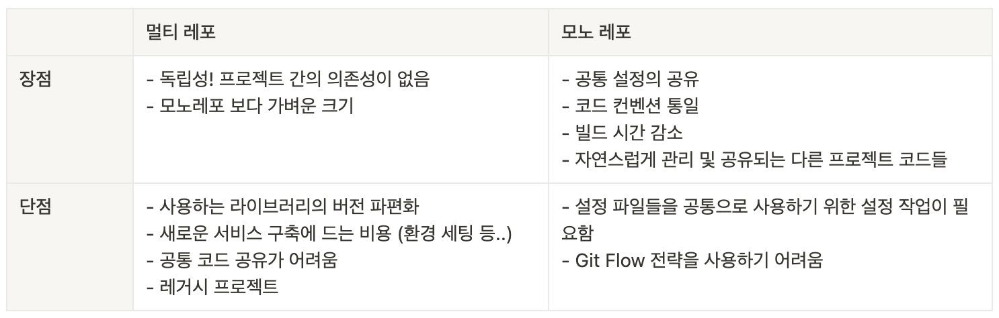

## 요약



## 멀티레포와 모노레포?

### 멀티레포

멀티 레포는 **여러 저장소에 프로젝트를 분산**하여 관리하는 방법입니다.

멀티레포(multi repo)는 폴리레포(poly repo)로도 불리웁니다.  
폴리보다는 멀티가 더 직관적이어서 멀티레포로 부르는게 편한 것 같습니다.

멀티레포는 각 저장소 별로 관리를 하기 때문에 다른 프로젝트와 의존성을 갖고 있지 않습니다.  
그래서 **독립적**으로 빠른 개발이 가능하여 프로젝트 별로 유연하게 개발이 가능하고, 확장이 쉽습니다.  
또한 모노레포에 비해 크기가 가벼운 장점도 있습니다.

하지만 모노레포가 나오게 된 배경이 된 멀티레포의 단점들도 존재합니다.

1. 새로운 프로젝트를 시작할 경우에 다시 처음부터 **프로젝트 환경을 설정**해야 합니다.  
   중복된 설정을 반복해야 하는 번거로움이 생깁니다.
2. 또한 그 때 사용하던 라이브러리들이 업데이트 되었다면?  
   **프로젝트 별로 사용하는 모듈 및 버전 스택**이 달라질 수 있습니다.
3. 오래동안 건드리지 않는 프로젝트가 있을 수 있습니다.  
   그 프로젝트의 저장소는 아무에게도 관심받지 못하고 **레거시 프로젝트**가 될 수 있습니다.
4. 다른 저장소의 코드에는 관심을 가지기 힘든 구조입니다.  
   관심을 가진다고 하더라도 그 저장소를 담당하는 개발자에게는 월권으로 받아들여질 수 있습니다.  
   또한 같은 이슈를 겪더라도 그런 **이슈에 대해 공유**가 되기 어렵기 때문에 서로 모른 채 시간을 낭비할 수 있습니다.

이렇게 보면 멀티레포는 단점 뿐이고, 모노레포를 무조건 써야할 것 같습니다.  
그렇지만 모노레포가 무조건 옳은 것인지는 아직 모르겠습니다. 아래 글에서 더 알아 보겠습니다.

### 모노레포

모노는 단단히 짜여 하나로 되어 있는 의미를 가진 Monolithic의 준말입니다.  
개별로 저장소를 운영하는 멀티레포 와는 다르게  
**하나의 저장소에 여러 프로젝트 패키지**를 가진 것을 의미합니다.

root level에서 공통의 설정들(eslint, babel, prettier 등)을 관리할 수 있습니다.  
여러 패키지에서 하나의 설정 공유가 가능하기 때문에 **코드 컨벤션 통일**이 가능합니다.  
또한 저장소의 global 설정을 extends하고 프로젝트 별로 설정을 override 할 수 있습니다.

공통 컴포넌트 라이브러리에서 수정사항이 발생한다면?  
멀티레포라면 공통 컴포넌트 저장소에 가서 수정 -> 배포 -> 다른 프로젝트 코드 열고 -> 의 번거로운 과정을 거쳐야 합니다.  
그렇지만 모노레포로 운영한다면 이 과정이 필요없습니다. 패키지를 편하게 넘나 들 수 있습니다.

또한 **1 PR**이 가능합니다.  
예를 들어 30개의 프로젝트가 있습니다. 이 프로젝트들은 common이라는 하나의 저장소에 모두 의존성을 갖고 있습니다.  
common에 수정사항이 발생했습니다.  
그러면 30개의 프로젝트들은 이를 반영하기 위해 모두 한 번에 수정하여 배포해야 합니다.  
이 하나의 변경사항으로 인해 30개의 PR이 생기게 됩니다.
모노레포라면 30개가 1개로 줄어들 수 있는 것입니다.

## 모노레포 구성

모노레포 구축을 도와주는 도구들이 있습니다.

- Yarn
- Turborepo
- Lerna
- Yarn + Lerna
- NPM + Lerna
- pnpm
- Nx

저는 yarn1, yarn berry와 turborepo를 실습해 보았습니다.  
berry는 yarn1에 없던 명렁어가 추가되어 좀 더 편해졌습니다.  
그렇지만 yarn berry를 사용한다면 설정해야 될 초기 작업이 정말 많습니다...
이 설정들이 필요한 작업이지만 터보레포는 이 작업들의 추상화가 잘 되어 있어서 뚝딱 모노레포 환경을 구성할 수 있습니다.

## 모노레포 운영

이 쯤이면 궁금해집니다. 모노레포에서 브랜치 전략은 어떻게 해야 할까?  
보통의 Git flow 전략과는 맞지 않는 것 같습니다.

현재 모노레포에 적용되는 브랜치 모델에는 TBD가 있습니다.

### TBD 원칙

TBD(Trunk Based Development)의 핵심은 **브랜치의 수명 주기**과 **하나의 브랜치**입니다.  
**작은 단위로 커밋하여 분기를 짧게 가져 가고, 바로 trunk 브랜치(master)에 merge** 하는 것입니다

**보통의 Git flow 방법**

1. `master(main)`에서 `feature/add-something` 브랜치 생성하여 작업
   (작업 기간이 길어지면 그 사이 충돌 위험 높아짐)
2. 완료되면 `feature/add-something` -> `develop`
3. `develop` -> `master(main)`

**TBD**

1. `trunk`에서 `feature/add-something` 브랜치 생성하여 작업
2. `feature/add-something` -> `trunk`

이 때 브랜치는 최대한 작은 기능 단위로 분기를 만들어서, 빠른 시일 내로 merge 해야 합니다.  
브랜치는 최대 2-3일이 넘지 않도록 **짧은 수명 주기**를 가져야 합니다.

또한 trunk에 반영하기 전에 최대한 에러 발생을 줄여야 하므로, 모든 변경 사항에 **테스트 코드 작성**이 필요합니다.

상세하게 작성된 아티클을 첨부합니다.  
[TBD 브랜치 전략](https://uhgenie7.github.io/docs/dev/git/trunk-based-development#6-feature-flag-feature-toggle)

### Feature Flag

테스트 후에 배포했다고 하더라도 예상하지 못한 문제가 발생할 수 있습니다.  
feature flag는 TBD의 위험성을 보완할 수 있는 기능입니다.  
**배포할 기능마다 Flag를 설정하여, 외부에서 해당 기능의 활성화 여부를 설정**하는 것입니다.  
이를 이용하여 a/b test에도 활용할 수 있지 않을까 생각이 듭니다.

## 오픈소스 탐험

모노레포를 공부하고 나니 많은 오픈소스들이 모노레포로 구성되어 있음을 알 수 있었습니다.

[redux-toolkit](https://github.com/reduxjs/redux-toolkit)

- yarn 3.2.4 사용
- root에서 공통 config를 관리하지 않음
- `nodeLinker` 를 통해서 yarn + npm 하이브리드 사용을 알 수 있음
- yarn에서 제공하는 버저닝 플러그인 사용

```
// .yarnrc.yml
nodeLinker: node-modules
plugins:
  - path: .yarn/plugins/@yarnpkg/plugin-workspace-tools.cjs
    spec: '@yarnpkg/plugin-workspace-tools'
  - path: .yarn/plugins/@yarnpkg/plugin-version.cjs
    spec: '@yarnpkg/plugin-version'
```

[tanstack/query](https://github.com/TanStack/query)

- pnpm + lerna
- root에서 공통 config 파일을 만들어 패키지 별로 override

```
// query/packages/react-query/tsconfig.json
{
  "extends": "../../tsconfig.base.json",
}
```

프로젝트마다 공통 설정 파일은 어떻게 사용하는지  
CI는 github action, circle CI 어떤 것을 사용하고 운영하는 지 보면 도움이 많이 될 것 같습니다.

**🚌 다른 곳들은 어떻게 구성되어 있을지 구경가기**

- [toss/slash](https://github.com/toss/slash/blob/main/README-ko_kr.md)
- [당근마켓 웹사이트](https://github.com/daangn/websites)
- [adobe/react-spectrum](https://github.com/adobe/react-spectrum)

## 모노레포는 만능인가?!

모노레포의 장점이 많지만 상황에 맞게 채택하는 것이 좋습니다.

서비스를 운영중이고 추가적으로 디자인 시스템을 개발해야 하는 경우를 생각한다면  
디자인 시스템 개발 과정에서 많은 브레이킹 체인지가 있을 것이므로  
한 저장소에서 관리하는 모노레포가 효율적일 것입니다.

물론 이 외에 요소도 고려해야 하는 것은 당연합니다.

또한 TBD 전략에 필수적인 기능 별 테스트 코드 작성에 충분한 학습이 되어 있지 않다면?  
이 또한 모노레포 도입이 어렵지 않을까 생각합니다.

[전 Github CTO, 지난 10년간 가장 큰 아키텍처 실수는 풀 마이크로서비스로 전환한 것](https://news.hada.io/topic?id=7839)  
이 아티클에서는 모노레포가아닌 MSA에 대해 말하지만, 모노레포 도입을 고민할 때에도 보면 좋은 내용인 듯 합니다.

## Self Q&A

- **Q. npm을 사용하는 프로젝트를 마이그레이션한다면?**  
  A. yarn에서 제공하는 `nodeLinker` 옵션을 통해 점진적으로 마이그레이션이 가능합니다.

- **Q. 백엔드랑 같이 모노레포로 관리하는게 좋을까?**  
  A. 프론트와 백엔드 둘 다 typescript를 사용한다면 타입이 변경되었을 때 실시간 동기화가 되는 이점이 있을 수 있을 것 같다.

- **Q. MSA랑 모노레포는 같은 개념인가?**  
  A. MSA를 할 때 소스관리를 잘하기 위해 모노레포 구성 전략을 사용하는 것이다.  
  프론트엔드 관점의 MSA에는 마이크로 프론트엔드로 많이 불립니다.

## 참고하면 좋은 레퍼런스 모음

- [pnpm으로 구성한 배민스토어의 모노레포 - 우아콘2022](https://youtube.com/watch?v=Bycg5w5qXfE&feature=shares)
- [버즈빌의 모노레포 운영 가이드](https://tech.buzzvil.com/handbook/workingflow-in-monorepo/)
- [그린랩스](https://youtube.com/watch?v=CsbBuE_MF2U&feature=shares)  
   그린랩스가 터보레포를 선택한 이유  
   -> Vue, Next를 사용하고 있었고, Next.js에 잘 맞고, 웹 개발에 맞는 도구라고 판단하였다고 합니다.
