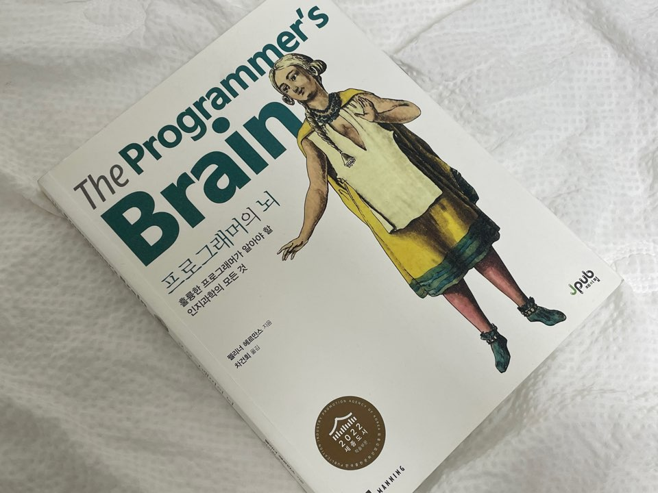

개발자로서 지속적인 성장은 중요하다.  
어떻게 하면 효율적으로 공부할 수 있을까 고민할 때 이 책을 알게 되었다.

대상 독자에 다음과 같이 적혀있다.

- 프로그래밍 스킬을 향상하고자 하는 모든 개발자
- 나만 못한다는 자괴감에 빠진 주니어 개발자

나잖아..? 냉큼 이 책을 구매했다.

`프로그래머의 뇌`는 우리가 당연하게 지켜온 컨벤션이 유용한 이유, 복잡한 코드가 이해하기 어려운 이유를 말한다.  
또한 이에 대한 해결 방법과 좋은 코드에 대해 인지 과학 관점에서 설명한다.

> **인지 과학**  
> 인간의 사고와 인지 능력에 대해 연구하는 학문이다.
>
> - 우리가 무엇을 보고 알아차리는 것이나 정보를 처리하고 기억하는 방법
> - 학습하는 방법, 의사 결정을 내리는 과정
>   연구를 통해 우리가 어떻게 생각하고 행동하는지를 이해하는 데 도움을 준다.

## LTM, STM, 작업 기억 공간

개발할 때 우리 뇌의 동작 원리를 다음 세 가지 개념을 통해 설명한다.

**✅ LTM(Long-Term Memory, 장기 기억)**  
 경험과 학습을 통해 **오랜 기간** 동안 형성되서 우리가 익숙해진 기억이다.  
 문법, 패턴, 알고리즘에 해당한다.

자전거도 처음에는 안장에 올라서, 핸들을 잡고 발을 굴리는 프로세스를 생각하며 탄다.
배우고 나면 오랜 공백 기간이 있어도 의식하지 않고 탈 수 있다.
장기 기억에 저장된 덕분이다.

**✅ STM(Short-Term Memory, 단기 기억)**  
 현재 인지 과정에서 **일시적**으로 유지하는 정보다.  
 해석하고 있는 코드의 변수명, 로직에 관련된 정보가 포함된다.

**✅ 작업 기억 공간(Working Memory)**  
 코드를 읽는 동안 활성화된 STM의 일부를 포함하는 개념이다.  
 현재 집중하고 있는 코드 블록, 해결해야 할 문제에 관련된 정보를 유지하는 데 사용된다.

복잡한 코드를 해석하다가 정작 해결해야 할 이슈에서 멀어지며 삼천포로 빠질 때가 있다.  
 작업 기억 공간을 적절히 활용해야 방지할 수 있어 보인다.

## 코딩 중에 겪는 혼란

> 지식이 없다는 것은 두뇌의 장기 기억 공간에 해당 내용이 벗다는 것을 뜻한다.  
> 반면에 지식이 아닌 어떤 정보가 부족할 때는 단기 기억 공간에 해당 내용이 없기 때문이다.  
> 정보를 수집할 때 단기 기억 장소에 일시적으로 저장하지만, 다른 정보를 찾는 과정에서 이미 수집해놓은 정보 중 일부는 잊어버린다.  
> 마지막으로 많은 정보를 처리할 때는 작업 기억 공간에 영향을 미치는데 우리는 사고할 때 이 영역을 사용한다.
>
> p.7

다음 이유들로 인해 인지 부하가 오고, 두뇌가 제대로 처리하지 못해 개발이 어려워진다.

1. **지식 부족**
   코딩을 많이 해도 개념을 모르면 발전하지 않는다.  
   비동기에 대해 알지도 못하고 비동기 함수를 쓰면 무분별한 `await`만 남발하게 되는 것과 같다.

2. **정보 부족**

```js
getValidDateFormat (date, format = 'YYYY-MM-DD HH:mm:ss') {
  return date ? moment(date).format(format) : ''
}
```

함수, 삼항 연산자에 대한 이해가 있다면 대략 이해할 수 있다.  
하지만 `momemt` 라이브러리에 대한 정보가 없다면 헷갈릴 수 있다.

3. **처리 능력 부족**
   두뇌의 처리 용량이 부족하기 때문이다. 로직에서 사용하는 변수가 많다면 코드를 따라가다가 헷갈릴 수 있다.

결국 장기 기억, 단기 기억, 작업 처리 공간이 유기적으로 작동해야 코드가 쉽게 읽힐 수 있다.

특히 장기 기억에 저장된 정보가 많다면 작업 처리 공간의 부담이 덜한다.  
경험이 많은 개발자들이 더 빠르게 코드를 파악하는 이유는 장기 기억이 강화되어 있기 때문이다.

## 코드 잘 읽기

저자는 코드를 잘 읽을 수 있는 방법을 제시한다.

### LTM 강화

> - 문법에 대한 지식이 많을 수록 청킹을 쉽게 할 수 있기 때문에 문법을 외우는 것이 중요하다.
> - 앞면에는 프롬프트를, 뒷면에는 플래시카드를 사용해서 새로운 문법을 연습하고 기억할 수 있다.
> - 기억이 없어지는 것을 방지하기 위해, 새로운 정보를 기억하는 연습을 정기적으로 하는 것이 중요하다.
> - 최상의 연습은 기억한 것을 두뇌로부터 인출하는 연습이다. 다른 곳에서 해당 정보를 찾기 전에 기억해내려고 노력해야 한다.
> - 기억하는 지식의 양을 최대로 하기 위해서는 연습을 긴 시간에 걸쳐 고르게 해야 한다.
>
> p.50

어떻게 보면 우리는 이미 다 알고 있다.  
결국 의도적으로 암기하고 직접 코드를 치며 적용해야 한다는 정석적인 가이드다. 🥹

#### 청킹

코드를 그룹 단위로 묶는 것을 말한다.  
**디자인 패턴 지식과 청킹 능력은 비례**하고, 코드를 더 빠르게 수정할 수 있다는 연구 결과가 있다.

청킹은 적극적으로 코드를 기억해내는 의도적인 훈련을 통해 향상시킬 수 있다.

1. 코드 선정 (최대 50라인 이내)
2. 코드 파악 (최대 2분을 넘지 않도록 시간 제한)
3. 코드 재현
4. 회고
   - 어느 부분을 쉽게 기억했는가?
   - 기억하지 못한 코드가 있는가?
   - 기억하지 못했다면 모르는 프로그래밍 개념이 있는가?
   - 익숙하지 않은 도메인 지식이 있는가?

메타인지와 연관이 있어 보인다.  
회고를 통해서 내가 모르는 부분에 대해 객관화하고 강화시킬 수 있겠다.

#### 플래시카드

저자는 문법 암기가 힘들 때는 플래시카드를 추천한다.
개발 공부에도 이런 방법을 적용한다는 게 신기했다.

> **플래시카드**  
> 플래시카드는 영단어를 외울 때 앞면에 apple, 뒷면에 사과를 적는 방식이다.

#### 인출하는 연습

문법을 외우지 않고 검색하는 습관을 지양해야 한다.
기억하려고 노력하지 않고 찾아보기만 하므로 기억 공간에서 인출 강도가 약해져서 좋지 않다.  
또한 검색을 하기 위해 작업이 중단되면 개발 생산성이 떨어진다.
작업 기억 공간이 원래 작업하던 코드에 대한 정보를 잃어버려서 업무 재개를 위해 의도적으로 노력해야 한다.

정말 일회성 코드라면 의도적으로 기억할 필요는 없겠지만 자주 쓰는 코드라면 암기해야 한다.
구글링이 습관이 됬을 때 이런 단점들을 겪었고 지양하려고 노력했다. 노력중이다..🫠

1. 자주 썼었는데 기억이 나지 않는다. 또 검색한다.
2. 검색에 의존하게 되어 스스로 생각하는 힘이 약해진다. ☠️

> 업무가 중단된 후 코드 작성 작업을 다시 시작하는 데 약 25분이 소요됐다.
> 메서드를 작성하다가 중단되면, 프로그래머가 1분 이내에 작업을 재개할 수 있었던 경우는 10%에 불과했다.
>
> p.198

### 문제 해결 능력 개선

문제 해결력을 높이기 위해 LTM을 효율적으로 사용하는 방법이다.

#### 자동화

> 작은 것들을 알아내는 데 시간을 많이 쓰지 않을수록 어려운 문제들을 더 쉽게 풀 수 있다.

작은 것들은 자동화해서 작업 기억 공간의 부하를 줄이는 것 같다.  
어디까지 자동화할 지는 다르겠지만 코드 작성에 필요한 자동화로 linting이 떠오른다.  
linting 없이 코드 작성...? 😱

#### 다른 사람 풀이보기

> 새로운 수학 공식을 가르칠 때 A그룹에는 자세한 풀이과정을 함께 주었고, B 그룹에는 스스로 터득하도록 하였다. 이후 해당 수학공식을 이용한 문제를 풀 때 A그룹의 정답률이 당연히 높았으며, 놀라운건 풀이속도가 B그룹보다 5배 빨랐다.  
> 또한 해당 수학공식을 응용한 다른 문제를 풀 때에도 A그룹이 우수한 성과를 보였다.  
> 이러한 학습방법을 프로그래밍에도 사용하기 위해서는 자주 사용하는 라이브러리의 깃허브를 보는 것이 유용하다.

스스로 생각해서 해결해야 사고력과 지속력이 좋아질거라 생각했다.  
돌이켜보면 알고리즘 문제를 끙끙대며 풀었어도, 너무 고생했던 탓인지 금방 휘발되었다.  
너무 모르는 지식은 풀이 과정을 알면 단게별로 사고하는데 도움이 되는게 맞는 것 같다.

클론 코딩도 떠오른다. 아무 것도 모르는 상태에서 프로젝트를 하기는 어렵다.  
클론 코딩을 통해 배운 지식으로 내 프로젝트를 만드는 연습을 한다면 효율적인 학습이 되겠다.

### 코드 작성 개선

#### 몰입

> 85명의 프로그래머에 대해 1만 회의 프로그래밍 세션을 기록했다. 그는 개발자들이 이메일이나 동료들 때문에 얼마나 자주 업무를 중단하는지 확인했고 그 후에 무슨 일이 일어나는지도 관찰했다.  
> 그의 연구에 의하면 코딩을 작성하는 도중 중단이 되면 다시 그 업무로 돌아가는 데 약 15분 정도 걸렸다.  
> 메서드 수정 작업 도중 중단이 되고 나서 1분 이내에 하던 일을 다시 시작하는 경우는 10% 정도밖에 되지 않았다.
>
> p.38

멀티 태스킹이 효율적이지 않다는 연구 결과다. 코드를 치다가 메일이나 슬랙을 확인하는 행동도 작업에 방해가 된다고 한다.  
작업 기억 공간이 원래 작업하던 코드에 대한 중요한 정보를 잃어버린다는 것이다.

나도 복잡한 로직을 작업 도중 멈추면 내가 뭐하려고 했더라? 고민하고 작업을 다시 시작한다.

개발할 때에도 **몰입**이 중요하다.

하지만 현실적으로 매번 몰입하기는 어렵기 때문에 **작업을 쪼개서** 하는게 도움이 된다고 한다.

나도 한 피쳐를 작업하기 전에 어떻게 세분화해서 작업할 지 계획하고 시작한다.
계획없이 코드부터 치는 것보다 효율적으로 작업할 수 있다.

## 요약

- 검색해서 순간적으로 얻는 지식은 아는 것이 아니다.
- 의도적으로 외우려고 하고, 반복해라.
- 단기적인 집중보다 꾸준히 하는게 효과적이다.
- 새로운 지식을 배울 때는 다른 사람의 풀이를 보는게 좋다.
- 개발하다가 딴짓하면 효율이 떨어진다.

코드를 많이 친다고 늘지 않는다.  
중요한 것은 꺾이지 않는 ⭐️**의도적 연습**⭐️

## 마치며

인지 과학 관점으로 프로그래밍을 바라본 게 흥미로웠다.  
개발 공부라고 다르게 생각했었는데 크게 다르지 않음을 보여준다.
복잡한 코드로 괴로울 때 내 뇌가 지금 오류를 겪고 있구나 하고 다독이며, 이전보다 침착하게 해결해 나갈 수 있을 것 같다.

책에는 자세하게 쓰여 있고 상세한 예시가 많아서 읽어 보기를 추천한다.

다만 키워드가 어색해서 여러번 읽어야 되는 부분이 아쉬웠다.  
반대로 뇌 과학에 익숙한 사람들은 쉽고 재밌게 읽을 수 있겠다. 👍
