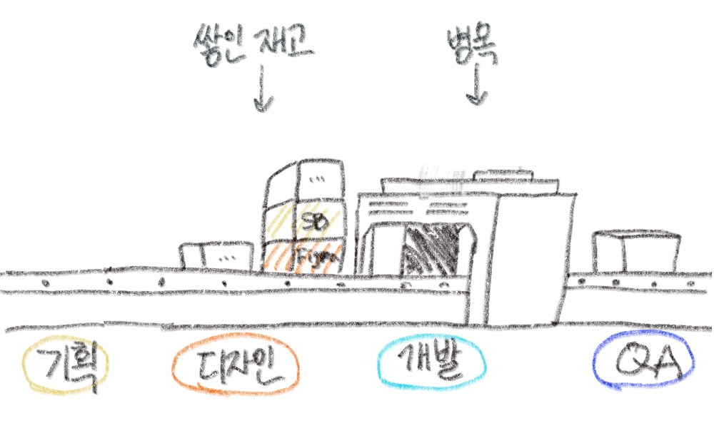
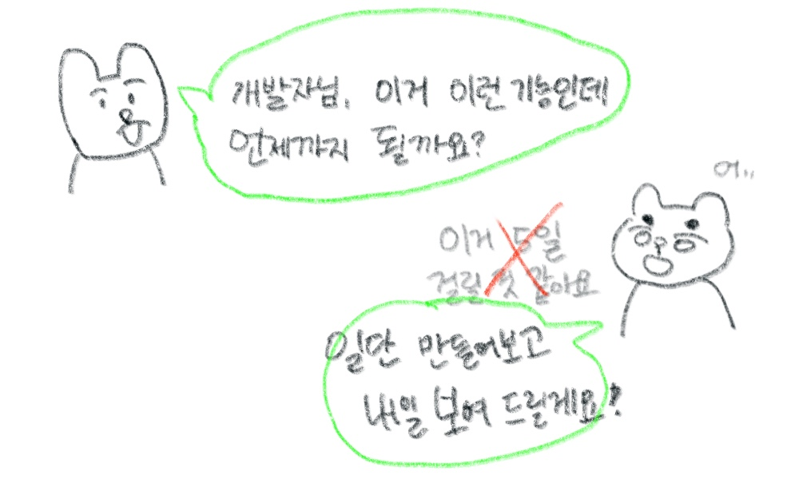

최근에 참석한 테오의 독서모임에서 [The Goal](https://search.shopping.naver.com/book/catalog/32466975989?cat_id=50005827&frm=PBOKPRO&query=the+goal1&NaPm=ct%3Dlomwn8og%7Cci%3D1eb6c6a0f4ffd0a21cef6b6e2596aef6267af7ec%7Ctr%3Dboknx%7Csn%3D95694%7Chk%3Df55608646eaa10a2ce6c77aa630dae600ae4d553)을 읽었습니다.  
경영학의 관점을 개발에도 대입해볼 수 있구나 신기했고, 적용해보며 정말 유익했던 시간이었습니다.

독서모임에서 느낀 점을 간략하게 정리해 봤습니다. (제목에 대한 내용은 글의 중반부에 있어요!)

## 소개

The Goal은 600쪽의 매우 두꺼운 책으로 출판사는 이렇게 소개합니다.

> 30여 년 동안 인류의 삶을 바꾼 경영서!
>
> 경제경영의 고전 『더 골』의 최신 개정판. 세계를 제패한 기업 아마존 CEO 제프 베저스, 현대 경영학의 창시자 피터 드러커를 비롯하여 국내에서는 서울대 경영대 교수진, 삼성경제연구소(SERI) 등 전 세계적으로 > 학자와 경영인 모두가 추천 도서로 꼽은 이 책은 30여 년 동안 수많은 기업의 패러다임을 바꾼 역사상 유례를 찾기 힘든 경제경영 베스트셀러이다.

모임 전까지는 개발자인 저에게 경영, 고전이란 키워드들은 먼나라 말처럼 느껴져였는데요.  
이런 책을 개발에 어떻게 대입해서 얘기를 나누는걸까 의구심이 들었네요.  
그러나 개념을 설명하는 방식이 아니라 소설로 이야기를 풀어내서 읽기 편했습니다.  
(그래도 통계적 변동, 이런 말이 나올 땐 힘들었던..🥹)

작가는 공장장 알렉스가 망해가는 공장을 살리기 위한 해결과정을 담습니다.

공장장 알렉스는 3개월 안에 수익을 내지 못하면 공장이 폐쇄되는 위기를 맞습니다.  
알렉스의 오래전 교수였던 요나 박사는 알렉스의 조력자로 공장의 수익 개선을 돕습니다.

공장이 겪고 있던 문제들입니다.

- 직원들이 하루 종일 쉬지 않고 일하는데 왜 매출은 떨어질까?
- 운영비를 아끼기 위해 지출을 최소화했는데 왜 매출은 떨어질까?
- 창고에는 재고가 쌓여 있는데 왜 납품일을 맞추지 못할까?
- 신기술을 도입하고 최신 기계를 들였는데 왜 생산성은 나아지지 않을까?
- 인건비를 아끼기 위해 직원을 해고했는데 왜 현금 유동성은 더 나빠질까?

요나 박사는 바로 해결법을 주지 않고, 이 문제들을 알렉스가 스스로 해결하도록 질문만 던져줍니다.  
(소크라테스식 질문법이라고 하더라구요)

알렉스가 애타게 교수님을 불러도 그는 답안을 알려주지 않습니다.  
어쩔 수없이 알렉스는 직원들과 울며 겨자먹기로 해결해 나가며 점점 성장하는 모습도 보여줍니다.
당연히 공장은 폐쇄를 막는 것을 넘어서서, 완전 흑자로 전환하구요.

공장의 생산 방식의 문제점과 해결 방법을 우리들의 회사에 대입해 토론했던 내용들입니다.

## 목표

> 2막 소크라테스를 만나다 - “자네 공장의 목표가 뭔가?”
>
> ”생산성이란 말도 회사가 목표 달성을 얼마만큼 했는지를 말하는거고 그 반대로 목표에서 멀어지게 하는 모든 행위는 비생산적인거라고 보면 되네.”  
> ”목표가 뭔지 정확하지 않으면 생산적인 게 뭔지도 알 수가 없어.”

**회사의 궁극적인 목표**가 무엇이라고 생각하시나요?
**돈을 버는 것**입니다.

개발자는 영업직도 아니고, 회사에 기여하는 부분이 정확하게 수치화되 않습니다.  
저는 비즈니스 가치를 내는 개발자를 지향하면서, 어떻게 될 수 있는가 고민이 많았습니다.

어찌보면 단순하더라구요. 개발자는 개발 밖에 할 수 없으니까요.  
개발 팀의 목표는 버그없이 일정에 맞춰서 프로덕트를 출시하는 것입니다.

그렇다면 야근을 해서라도 목표를 달성해야 할까요?  
하지만 야근은 우리의 목표가 아님을 염두하고, 계속 리뷰해 보겠습니다.

## 통계적 변동

> 3막 새로운 운영 지표를 찾다 - “직원들이 쉬지 않고 일하는 회사는 과연 효율적일까?”
>
> “(…) 종속적 사건이지. 어떤 사건이 일어나려면 꼭 그 전에 한가지 혹은 여러 가지 사건이 발생해야 한다는 뜻이네.”  
> ”통계적 변동이라 불리는 또 다른 현상과 결합될 때 중대한 일이 벌어지기 때문이지.  
> (…) 예측 불가능한 정보를 통계적 변동을 따른다고 하는 것이네.”

생각해 보니 통계적 변동은 늘 발생하는데, 이를 고려하지 못하고 작업기간을 산정했었습니다.  
(나름 +@라고 했음에도 계획대로 되지 않았었네요)

예를 들면 대체로 프론트와 백엔드가 병렬로 진행되다 보니,  
서버 데이터를 상상하며 작업하다가 실제로 적용했을 때 예상하지 못했던 에러가 발생하기도 했습니다.

그 외 나 또는 동료의 연차 사용도 예기치 못하게 발생할 수 있구요.

기획자분은 간혹 앱스토어 심사가 나지 않아서 IOS와 AOS가 다르게 배포된 적이 있는데,  
이런 경우 UI가 달라지면 정책이 2가지로 나뉘게 되서 관리 포인트가 늘어난 적도 있다고 했습니다.

## 병목 자원

> 4막 하이킹에서 수수께끼를 풀다 - “같은 속도를 걷는데 왜 대열은 점점 느려질까?”
>
> 알렉스는 하이킹을 하는 과정에서 소중한 인사이트를 얻는 2가지 경험을 합니다.
> 하나는 성냥 옮기기 게임이며 하나는 허비를 통해서 얻는 깨달음이죠
>
> ”결국 문제는 허비다. 제일 걸음이 느린 허비가 대열 전체의 현금 창출률을 결정하고 있어!”

알렉스는 생산성을 높이기 위해 공장의 병목자원이 무엇인지 고민하는데요.  
아들과의 하이킹에서 해답을 얻습니다.

하이킹은 예상보다 도착이 지연됩니다. 대열을 살펴보니 허비라는 친구가 걸음이 제일 느린 이유였습니다.  
제일 빠른 사람들이 있어도, 허비가 느리다면 함께 도착해야 하는 하이킹의 목표를 이룰 수 없습니다.

이 대열에서 허비는 병목자원이 됩니다.

저는 하이킹 과정에서 내가 함께 일했던 사람 중에 허비가 누구였을까 생각했습니다.  
(나도 허비였구나...반성도 하며..)

하이킹에서는 허비를 맨 앞으로 보내고, 무거운 짐을 다른 대원들이 나눠들면서 병목을 개선했습니다.

만약 팀에 업무 속도가 느린 팀원이 있다면?  
다른 팀원들이 그 업무를 분담하는게 병목을 해결할 수 있는 방법일까요?  
근데 그 팀원이 그냥 일을 대충하는 사람이라면? 이게 해결되는건가?

물음표는 꼬리에 꼬리를 물고...같이 책을 읽었던 해리와 고민을 많이 했습니다ㅎㅎ

공장의 관점에서 프로덕트에 대입했을 때  
**허비는 누군가가 아니라, 개발자 모두라는 점입니다.**

**개발 조직이 프로덕트 개발 사이클에서 병목자원이라는 말입니다.**
아무리 기획, 디자인이 되도 실제로 개발이 되지 않으면 프로덕트가 배포될 수가 없으니까요.

## 비병목 자원의 비효율성

> 5막 병목 자원을 찾아 헤매다 - “왜 수요와 공급이 최적화된 회사일수록 파산에 가까워질까?”
>
> “직원들이 쉼없이 일하고 있는 공장은 상당히 비효율적인 상태라고 보면 되네. 비병목 자원을 쉼없이 가동시키면 그 잉여 능력으로 과잉 재고를 만들게 되지.”  
> ”그럼 어떻게 하면 되나요? 기계를 멈추면 가동률이 줄어들텐데요?”  
> ”그래서 뭐가 문제인가?”

개발이 병목이므로 기획과 디자인 QA는 비병목 자원입니다.  
비병목 자원이 열심히 일하는데 왜 더 비효율적인가.  
직원들이 쉬고 있는거야말로 회사 차원에서 비효율적인 월급 루팡아닌가!? 띠용

개발이 진행되는 동안 기획과 디자인이 쉬지 않고 새로운 산출물을 만듭니다. 이 산출물은 개발에 쌓이게 됩니다.  
이 산출물들은 과잉 재고로 남게 되고, 레거시나 아주 오랜 백로그로 남게 됩니다.

현재 회사도 2년 전에 나온 기획서가 이제야 개발 작업에 들어갔네요.

## 병목 개선하기

> 7막 성공의 첫걸음을 떼다 - “지속적인 이익을 내려면 어떻게 해야 하는걸까?”
>
> ”비병목 자원의 1회 작업량을 반으로 줄이는 겁니다.”  
> ”우리가 1회 작업량을 반으로 줄이면 어떤 일이 일어날 것 같습니까? 리드타임을 반으로 줄이는 거예요.”

그러면 병목을 해소하기 위해 어떻게 해야할까..  
개발자들이 야근으로 쌓인 기획, 디자인을 개발하면 될 것 같지만 다시 우리가 생각해야 할 부분이 있습니다.  
우리의 목표는 프로덕트를 배포하는 것이지, 야근이 아닙니다.

리드 타임을 반으로 줄인다는 것은 **한 번에 모든 스펙을 개발해서 전달하지 않는 것**입니다.  
**즉 최소 기능의 테스트가 가능한 형태로 개발하여 배포하는 방식이다.**

기획자가 물어봅니다.

## 현금화가 되는 코드

일정 예측을 하기 보다 조금씩 빨리 만들어서 빨리 보여주는 것이 개발자가 지속적인 이익을 내는 방식입니다.

**이런 방식은 비즈니스 가치를 내는, 즉 현금화가 되는 코드를 만들어 낼 수 있습니다.**  
재고가 되는 코드는 배포되지 못하는 코드인데. 클린 코드에 집착해 PR이 늦어지던 최근이 떠올랐습니다.  
PR도 한 번에 올리려고 하면, 오히려 더 늦어지더라구요..  
그래서 최소 단위로 쪼개서 올려야겠다 싶었는데, 비슷한 관점으로 바라볼 수 있었습니다.

---

제시된 방법들이 모든 상황에서 적절하진 않지만 MVP를 만들어내기 위한 최적의 방법으로 보입니다.

개발을 하다 보면 확장성있는 코드에 매몰되어 계획했던 시간보다 딜레이되는 경우가 있었습니다.  
사실.. 사용자는 제품에서 원하는 기능을 딜레이없이 사용하는게 중요하지, 클린 코드는 모르는 부분이니까요.

The Goal을 읽는 독서 모임을 통해 좋은 코드에 대해 비즈니스 관점에서 바라볼 수 있었습니다.
