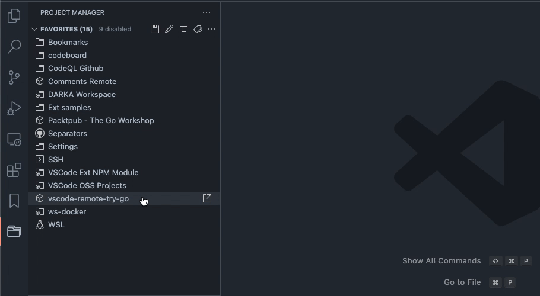

VScode를 사용하고 있으신가요?  
업무 생산성을 향상시키려면 VScode Extension 설치가 필수입니다.

지금까지 저의 업무 생산성을 높여준 유용한 VScode Extension을 공유합니다.

## 코드 스타일의 일관성

### Auto Close Tag

HTML 태그를 자동으로 닫아주는 기능을 제공합니다.

### Better Comments

주석을 색상으로 구분하여 가독성을 높여줍니다.  
중요한 주석, 작업 진행 상태를 구분합니다.

저는 `TODO`, `FIXME`를 많이 사용합니다.

### Code Spell Checker

오타를 감지하고 코드 내의 철자를 검사하여 올바른 철자를 제안합니다.

`.tabitem`처럼 단어가 붙어 있으면 `.tab-item`으로 수정하라고 알려줍니다.

### ESLint

코드에서 일반적인 오류와 컨벤션이 다르게 작성되면 에러를 표시합니다.

### Prettier - Code Formatter

일관된 코드 스타일을 유지하도록 코드를 자동으로 적용해 줍니다.

auto save 설정을 하면 저장할 때 자동으로 포맷팅됩니다.  
가끔 vscode 에러로 auto save가 안되는 경우가 있습니다. 껐다 키면 해결됩니다.

### vscode-styled-components

styled-components를 지원하여 CSS-in-JS 스타일링을 편리하게 작성할 수 있습니다.

## 협업과 코드 리뷰

### Git Graph

Git 저장소의 커밋 그래프를 보여줍니다.  
저는 별도의 Git GUI 툴(GitKraken)을 사용하면서 활용도가 낮아 졌습니다.

### Git Lens

코드 라인 단위로 Git 작업을 추적하고, 작성자 및 커밋 내용 등 Git 관련 정보를 표시합니다.

Commit hash가 적힌 오른쪽 버튼을 클릭하면 변경 전과 후의 코드도 확인할 수 있습니다.  
코드 히스토리를 추적할 때 유용합니다.

### i18n Ally

다국어 지원을 위한 도구로, 텍스트 리소스를 관리하고 번역을 지원합니다.  
마우스 오버하면 해당 스트링의 번역을 보여 줍니다.

### indent-rainbow

코드의 들여쓰기 단계별로 다른 색상을 제공하여 가독성을 높여줍니다.

### Peacock

작업하는 파일의 탭 색상을 변경하여 여러 개의 파일을 구별하기 쉽게 도와줍니다.

회사에서 유지보수하는 프로젝트가 많고, 모두 멀티레포여서 여러개의 vscode 창을 열어 놓습니다.  
탭 컬러를 통해 프로젝트를 구별할 수 있습니다.

### Project Manager

다양한 프로젝트를 관리하고 빠르게 전환할 수 있는 프로젝트 관리 도구입니다.

여러 프로젝트를 리스트해서 One-click으로 열 수 있습니다.

## 마크다운 편하게 쓰기

### Markdown Preview Enhanced

마크다운 문서를 실시간으로 미리 보기하고 편집할 수 있는 기능을 제공합니다.

기본 단축키는 `Shift` + `Command` + `P` 입니다.

### file-tree-generator

현재 작업 중인 폴더 및 파일의 트리 구조를 시각화하여 보여줍니다.  
프로젝트의 README를 작성할 때 사용하고 있습니다.

## VScode 꾸미기

### vscode icons

파일 확장자에 따라서 아이콘을 보기 쉽게 설정해 줍니다.  
파일 및 폴더의 아이콘을 변경하여 시각적인 구분을 도와줍니다.

### Fluent Icons

Fluent 디자인 시스템 스타일로 VScode의 아이콘을 바꿀 수 있습니다.

[material icon theme](https://marketplace.visualstudio.com/items?itemName=PKief.material-icon-theme)도 있으니 취향에 맞게 쓰시면 됩니다.

## AI 도구

### Github Copilot

코드를 작성할 때 추천 및 자동 완성 기능을 제공합니다.  
한 달 동안 무료로 사용할 수 있습니다.

현재까지 저는 대단하다 싶은 코드를 제안받은 적은 없지만,  
위 아래 코드 문맥을 파악해서 자동완성을 잘해줘서 편합니다.

### Codeium

VScode 내부에 사이드바에서 코드에 대한 설명을 해줍니다.

팀원분 추천으로 사용한 지는 얼마 안되었는데요.
구글링 시간 단축에 도움을 보고 있습니다.

---

이 글이 도움이 되면 좋겠습니다.

추천해주고 싶은 extension을 댓글로 나눠주세요! :)
